# 社区制作的外壳
# <b>
尽可能选择带 PCB 的外壳！
</b>
SlimeVR 社区构建了大量外壳，适用于不同风格、内部结构和用途。如果你希望将自己的外壳添加到本页面，请在 Github 上 fork 文档。

> 请注意，如果你正在寻找官方外壳作为替换件或用于官方 DIY 套件，[可在此找到！](https://shop.slimevr.dev/products/copy-of-slimevr-main-case-pc-plastic)。

* TOC
{:toc}

## Shine Bright 的 meowCarrier PCB 外壳
<b>
这是新构建最推荐的外壳
</b>
*由 Shine Bright 设计的 PCB、外壳和配件的 DIY 解决方案*

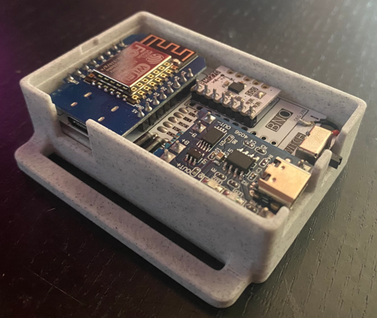

*图片：Meia*

* 可定制，更多订购和组装信息请参阅 Github。
* PCB，更多详情请参阅 Github。
* LSM6DSR、LSM6DSV、ICM-45686、BNO085
* 部分社区制作的适配/修改版本。
* 特定组件、电池尺寸和开关类型。

[Github](https://github.com/Shine-Bright-Meow/meowCarrier)

## Sorakage 的 CheeseCake PCB 外壳
<b>
这是新构建推荐的外壳。
</b>
*由 Sorakage 设计的非常美味的蛋糕*

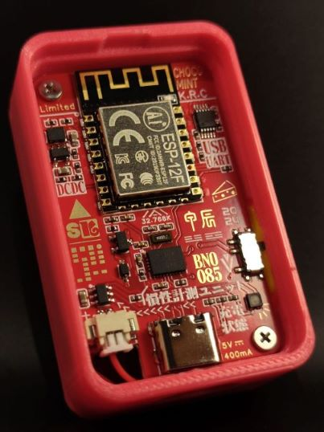

*图片：Sorakage*

* 可定制，更多信息请参阅 Github。
* PCB，更多详情请参阅 Github。
* BMI-160、BMI-270、BNO085、LSM6DSVTR、ICM-42688
* 热门选择，有丰富的社区适配/修改版本，主要用于更大容量的电池。
* 特定电池尺寸（803035 或 903035）

[Github](https://github.com/Sorakage033/SlimeVR-CheeseCake)

## Gorbit99 的 Tiny-Slime PCB 外壳
*由 Gorbit99 设计的基于模块的小型廉价 SlimeVR 追踪器*

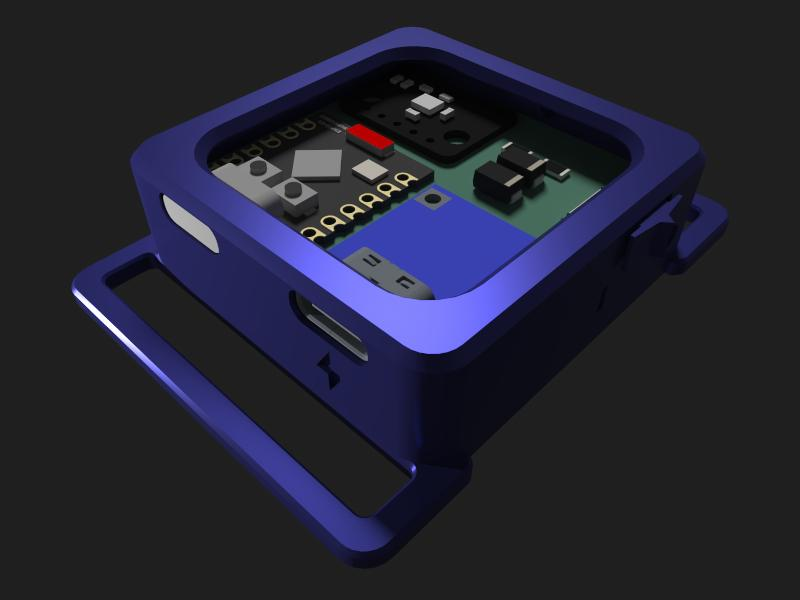

*图片：Gorbit99*

* 可定制，更多信息请参阅 Github。
* PCB，更多详情请参阅 Github。
* LSM6DSR、LSM6DSV、ICM-45686
* 部分社区制作的适配/修改版本。
* 天线仅在同一房间内可用。
* 特定电池尺寸、IMU、MCU、电源板。

[Github](https://github.com/gorbit99/tiny-slime/)

## ZRock35 的 Tiny-Official SlimeVR PCB 外壳
*Gorbit99 的 TinySlime 外壳的改版，适用于官方 SlimeVR PCB，并带有 Pixel 的夹子适配版本！*

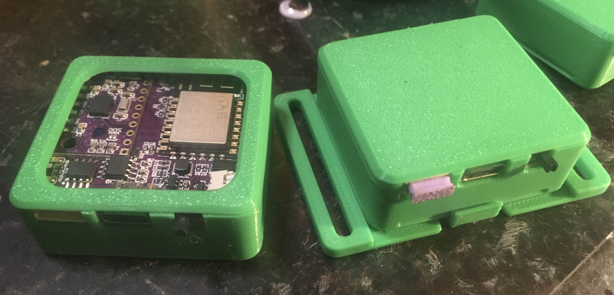

*图片：ZRock35*

* 非常简单小巧的 PCB 外壳，设计用于适配官方 SlimeVR PCB 和电池，无需修改。
* 开放式或封闭式顶部选项，带夹子背板，便于拆卸。
* BNO085 官方 PCB
* 官方 SlimeVR 标准电池。

[Github](https://github.com/ZRock35/TinyOfficial-Case)

## Frozen Slimes V2
*由 artemis/frosty 设计*

* 支持大多数 IMU
* 18650 锂离子电池

[Github](https://github.com/frosty6742/frozen-slimes-v2#frozen-slimes-v2)

# 历史/过时的外壳设计
*由于尺寸、内部结构或依赖不再推荐或支持的 DIY 配置，这些外壳不推荐用于新构建。*

## Shine Bright 的 Hyperion PCB 外壳
<b>
不推荐用于新构建的外壳。
</b>
*由 Shine Bright 修改的 Hyperion 设计，基于 Smeltie 的原版 Hyperion*

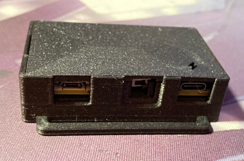

*图片：Shine Bright*

* 可定制，更多信息请参阅 Github。
* PCB，更多详情请参阅 Github。
* LSM6DSR、LSM6DSV、ICM-45686、BNO085
* 许多社区制作的适配/修改版本。
* 特定电池尺寸和开关类型。

[Github](https://github.com/Shine-Bright-Meow/SlimeVR-Hyperion-BMI-BNO-PCB-Case)

## Hyperion
<b>
不推荐用于新构建。
</b>
*由 Smeltie 设计*

* 可定制，更多信息请参阅 Github。
* D1 Mini
* MPU6050、MPU9250 和 BNO085
* 无数社区制作的适配/修改版本。
* 多种电池尺寸和开关类型。

[Github](https://github.com/Smeltie/Hyperion)

## Pucirion
<b>
不推荐用于新构建。
</b>
*由 Krysiek 编辑的 Hyperion 外壳，原版 Hyperion 由 Smeltie 制作*

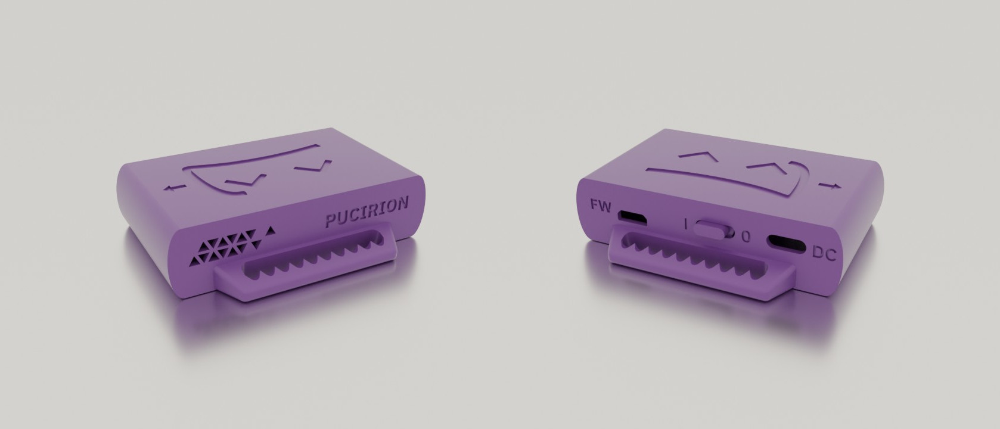

* 更强的把手带齿以固定绑带，更小，可访问 MicroUSB 端口，重新设计的通风口。更多信息请参阅 Github。
* D1 Mini
* MPU6050、MPU9250 和 BNO085
* Pucirion 仓库链接仅包含修改后的外壳 STL 文件，完整说明在 Hyperion 仓库中。

[Github](https://github.com/Krysiek/Pucirion)

## 柔性 TPU 外壳
<b>
不推荐用于新构建。
</b>
*由 ShoryuKyzan 设计*

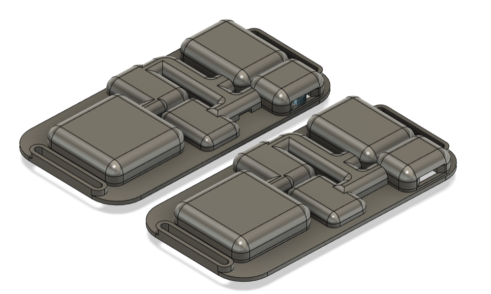

* 使用 TPU 耗材打印的 SlimeVR 外壳，设计为在 3 个位置弯曲，薄且贴合。更多信息请参阅 Github。
* NodeMCU D1 Mini v3 USB-C（带对角切角，边缘无孔）
* BNO085
* 804040 电池
* 更多详情、组件清单和说明请参阅仓库。

[Github](https://github.com/ShoryuKyzan/SlimeVR-Flexible-Case)

## Slidey-Slimes
<b>
不推荐用于新构建。
</b>
*由 punt-cuncher 设计*

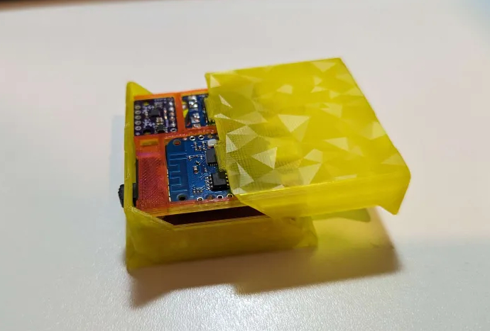

* 易于组装，相当紧凑的滑动式外壳设计。无需螺丝或胶水，只需焊接，将组装好的托盘滑入外壳，发出令人满意的卡扣声。
* D1 Mini 4.0
* BMI160、BMI270、BNO085（SlimeVR 商店版本）
* 804040 电池或更小
* 更多详情、组件清单和说明请参阅仓库。

[Github](https://github.com/punt-cuncher/Slidey-Slimes)

## Candy-Case
<b>
不推荐用于新构建。
</b>
*由 ManicQuinn 设计*

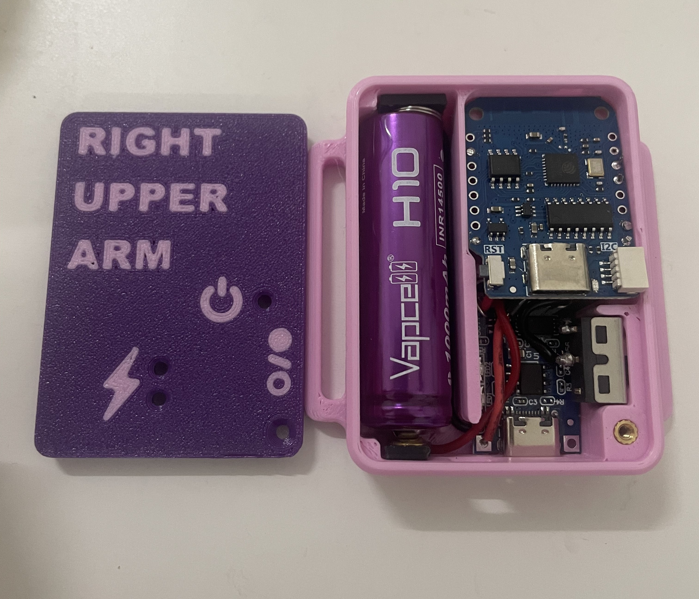

* 非 PCB 外壳设计，优化为在使用分线板时保持紧凑。
* D1 Mini 4.0
* BMI160、BMI270
* 14500 锂离子电池
* 更多详情、组件清单和说明请参阅仓库。

[Github](https://github.com/ManicQuinn/SlimeVR-Candy)

## Zaku² 外壳
<b>
不推荐用于新构建。
</b>
*由 Tom Yum 设计*

<video name="Zaku² 外壳组装" autoplay playsinline muted loop>
     <source src="../assets/videos/Zaku2_gif.webm" type="video/webm">
     <source src="../assets/videos/Zaku2_gif.mov" type="video/quicktime">
</video>

* Wemos D1 Mini
* TP4056 Type-C 充电板
* MPU6050
* 804040/BP-5M 电池

[Github](https://github.com/TomYumVR/Zaku2)

## Hexaeder
<b>
不推荐用于新构建。
</b>
*由 MaddesJG 设计*

* Wemos D1 Mini
* MPU9250 或 MPU6050
* 804040 锂聚合物电池

[Thingiverse](https://www.thingiverse.com/thing:5140456)

## Red 的外壳
<b>
不推荐用于新构建。
</b>
*由 Red 设计*

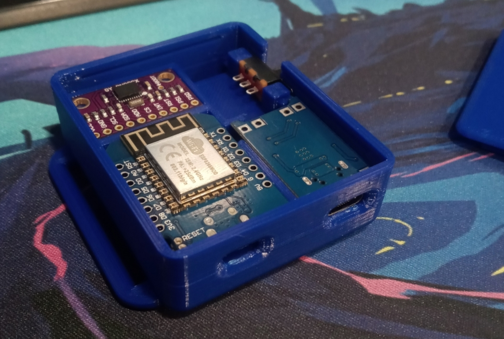

* D1 Mini
* TP4056 Type-C 充电板
* BNO08x
* 783448 1200mAh LiPo

[链接](../assets/cases/RedSlimeBasic.zip)

## SlimeVR Hello
<b>
不推荐用于新构建。
</b>
*由 Guiguig 设计*

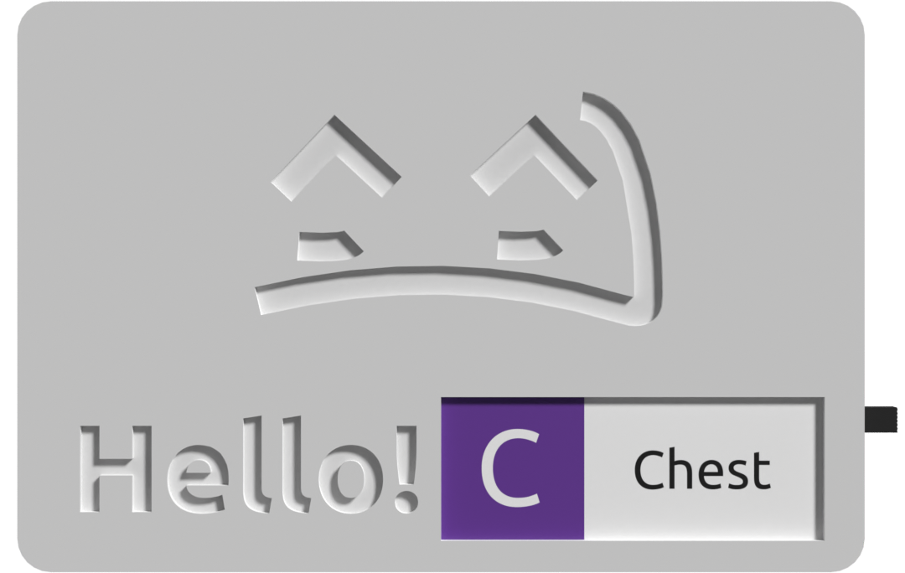

* Wemos D1 Mini ESP8266
* SPDT 1P2T 滑动开关
* BNO085
* 18650 电池

[STL](../assets/cases/SlimeVR_Hello_STL.zip)
[Fusion 360](../assets/cases/SlimeVR_Hello_v13.f3d)

## QuantumSlime
<b>
不推荐用于新构建。
</b>
*由 QuantumRed 设计*

* WeMos D1 Mini
* SS-12F15(VG6) 微型滑动开关
* GY-BNO08X
* 803040 3.7V 1000mAh Li-Po

[Github](https://github.com/Quantum-Red/QuantumSlimes/releases/tag/V4)

## Sauce Boss 的外壳
<b>
不推荐用于新构建。
</b>
*由 Sauce Boss 设计*

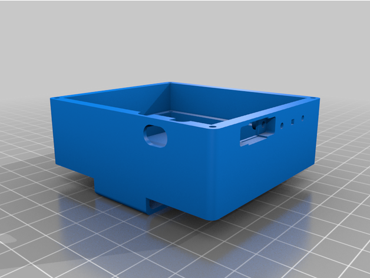

* ESP8266 NodeMCU
* 2 极开关
* BNO08x
* 2000mAh 电池

[Thingiverse](https://www.thingiverse.com/thing:4872694)

## Twidge 的 SlimeVR 紧凑型外壳
<b>
不推荐用于新构建。
</b>
*由 Twidge 设计*

* D1 Mini ESP 微控制器
* 7mm x 3mm x 8.3mm 面板开关
* BNO08x
* 503450 1000mAh 锂离子电池

[Github](https://github.com/TwidgeVR/slimevr_compact_case)

## Lixulia 的 Arcturus
<b>
不推荐用于新构建。
</b>
*由 Lixulia 设计*

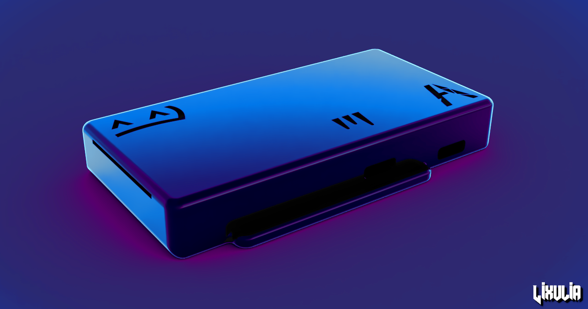

* D1 Mini ESP 微控制器
* DPDT 2P2T 电源开关
* BMI160 或 BMI270
* TP4056 USB-C 充电模块
* 804040 1200mAh 锂离子电池

[Github](https://github.com/Lixulia/Arcturus)

## Rosdayle 的 Minted Arcturus
<b>
不推荐用于新构建。
</b>
*基础设计由 Lixulia 制作*

由 Rosdayle 修改、完善并添加了一些功能

* D1 Mini ESP 微控制器
* DPDT 2P2T 电源开关
* BMI160 或 BMI270
* TP4056 USB-C 充电模块
* 603450 1100mAh 锂离子电池或小于 51x34x6mm
* GoPro 风格胸部支架

[Printables](https://www.printables.com/model/647109-minted-arcturus-slimevr-diy-standard-parts)

## SlimeX-FDM
<b>
不推荐用于新构建。
</b>
*由 Yasu3D 设计*

* Wemos D1 Mini V4 Wi-Fi 板
* TP4056 USB-C 充电板
* SS22F32 开关
* BMI160 IMU
* 804040 Li-Po 电池
* 28AWG 绞合硅胶线

[Github](https://github.com/Yasu3D/SlimeX-FDM)

## SlimeCon
*由 Strnadik 设计*

* 薄的 Joy-Con 尺寸外形
* 定制快速焊接 PCB
* 兼容广泛使用的 Joy-Con 魔术贴袋
* TP4056 USB-C 充电模块
* Wemos D1 Mini ESP-12 Wi-Fi 板
* MSK12C02 滑动开关
* 支持 Meia 和 Deyta 的 LSM6DSR / LSM6DSV IMU
* 1000 mAh 102050 LiPo 电池
* 包含电池检测和充电即用功能

[Github](https://github.com/strnadik/SlimeVR-SlimeCon)

## JSG 模块化外壳
*由 Jaime Shirazi Games 设计*

* D1 Mini V4.0.0
* ICM-45686 + QMC6309
* USB-C TP4056
* 模块化设计，轻松更换标签和外壳（不同绑带尺寸）
* 无 PCB 设计
* 使用标准 0.4mm 喷嘴和 PLA 快速打印
* GitHub 上有组装说明

[Github](https://github.com/JaimeShirazi/JSGModularTrackers)

*感谢社区如此出色，创造了这么多设计！*
