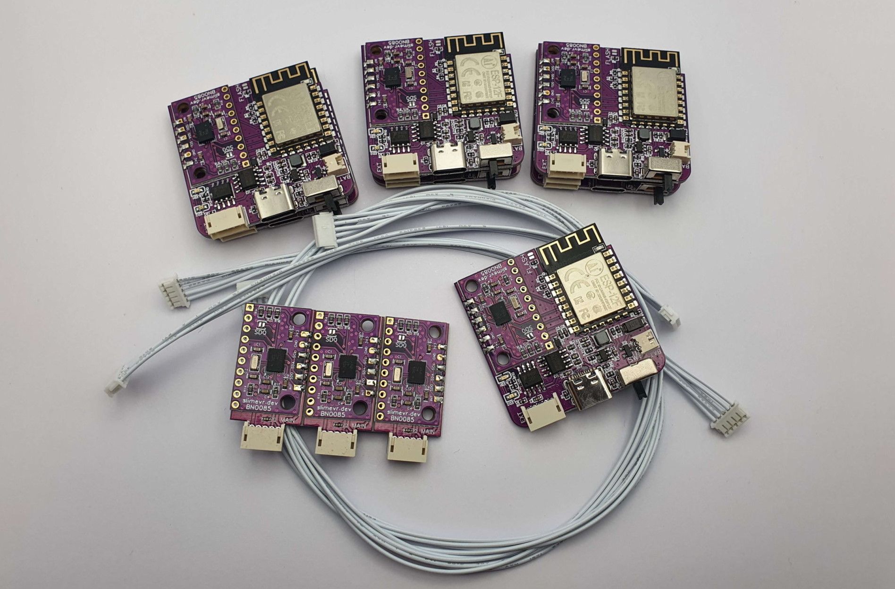
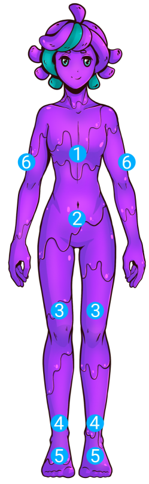
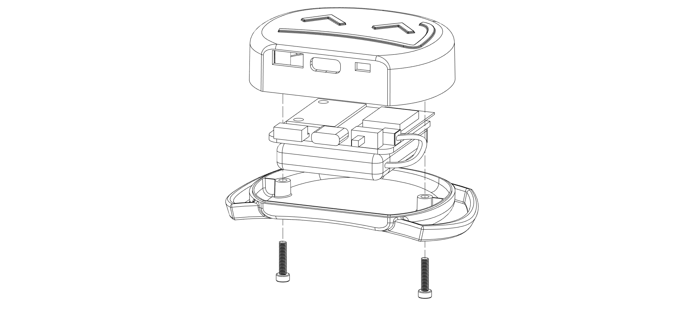
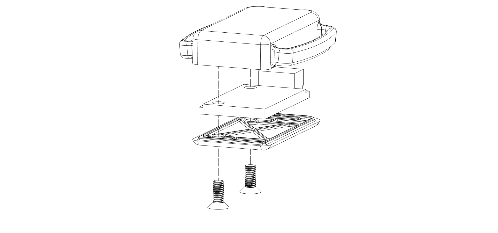
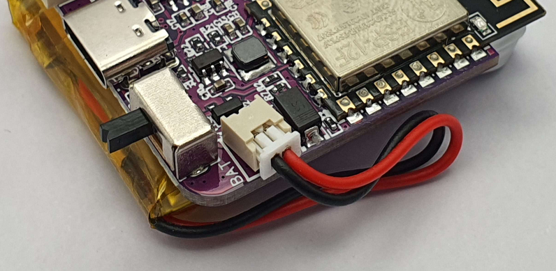

# SlimeVR DIY 套件

## 感谢购买 SlimeVR DIY 套件！
要让你的 DIY 套件投入使用，需要完成几个步骤。在本页面，我们将指导你完成创建一套可立即使用的 SlimeVR 追踪器的基本过程。虽然本指南包含一些通用建议，但欢迎你打破常规，让它们真正成为你自己的！玩得开心！

## 介绍
### 包装内容
SlimeVR DIY **1.2** 套件包含：8 块大型 SlimeVR 主板、2 块小型 SlimeVR 追踪器扩展板和 2 根扩展线缆（2 根短）。 
SlimeVR DIY **1.0** 套件包含：7 块大型 SlimeVR 主板、3 块小型 SlimeVR 追踪器扩展板和 3 根扩展线缆（1 根长，2 根短）。

### 所需额外物品
要完成你的 SlimeVR 追踪器，除了 DIY 套件外，你还需要一些零件。包括外壳、绑带、电池和 USB 线缆。以下详细说明这些内容，以便你更轻松地完成项目。

### 推荐安装布局
<table class="bpTable">
   <tr>
      <td>
         
      </td>
      <td>
         <ol>
            <li>胸部</li>
            <li>臀部（扩展板或主板）</li>
            <li>大腿</li>
            <li>小腿（向外安装）</li>
            <li>脚（扩展板）</li>
            <li>上臂（向外安装）</li>
         </ol>
      </td>
   </tr>
</table>

## 设计你的外壳
DIY 套件不包括外壳，因此需要外壳来保护它们并连接绑带。这些外壳可以 3D 打印、购买或手工制作。虽然官方 SlimeVR 主板和扩展板外壳设计用于适配套件中的 PCB，但由于其曲面，它们并不适合家用 3D 打印机。因此，我们建议使用修改后的设计自行打印，或设计自己的外壳！

官方主板和扩展板外壳的 3D 模型可在[此处](../assets/cases/OfficialCases.zip)找到。由 tomyum3dp 制作的更适合家用 3D 打印机的官方外壳修改版可在[此处](https://www.printables.com/model/425157-3d-printing-friendly-slimevr-cases-for-the-slimevr/files)找到。

对于计划自行设计外壳的用户，可在此处找到主板模型：[此处](../assets/files/MainPCB.step)和扩展板 PCB：[此处](../assets/files/ExtensionPCB.step)。

> 请注意，如果你正在为你的官方 DIY 套件寻找官方外壳，[可在此找到！](https://shop.slimevr.dev/products/copy-of-slimevr-main-case-pc-plastic)。

<u>使用官方外壳设计？</u>

要完成组装，主板和扩展板外壳各需要 2 颗 M2.5 螺丝。修改后的外壳使用更常见的 M3 螺丝作为替代。组装如下图所示。
以下视频更详细地介绍了官方外壳的组装过程！

<iframe width="100%" height="auto" src="https://www.youtube.com/embed/OxOgkBMEzME?si=jFoO5UXZPsxHKFEr" title="YouTube video player" frameborder="0" allow="accelerometer; autoplay muted; clipboard-write; encrypted-media; gyroscope; picture-in-picture" allowfullscreen></iframe>

## 选择你的电池
DIY 套件中的 SlimeVR 主板需要电池供电才能获得最佳体验。SlimeVR 追踪器在使用时大约消耗 100mAh。扩展板不需要自己的电池，它们使用所连接主板的电源。选择电池时，**至少选择 500mAh 的额定容量以确保安全使用。** 充电速率限制为 500mA，以确保最佳电池寿命。

我们推荐以下规格：
* 容量：1000-1800 mAh
* 标称电压：3.7v
* 连接器：Micro JST-MX 1.25mm

请注意，**主板上的集成充电电路仅适用于锂电池**，请勿尝试充电其他化学类型的电池。

电池尺寸取决于你选择使用或制作的外壳。锂离子聚合物软包电池有各种形状和尺寸，由 `XXYYZZ` 命名方案表示，分别表示厚度（X.Xmm）、宽度（YYmm）和长度（ZZmm）。例如，官方 SlimeVR 外壳设计使用 803443 电池，表示厚度 8.0mm、宽度 34mm、长度 43mm。

主板配备 Micro JST-MX 1.25mm 公头连接器端口用于连接电池。因此，最简单的方法是选择带有匹配母头连接器的电池。或者，你可以焊接或压接这些连接器到电池上，以便轻松连接到主板。

!!! danger
    确保电池极性匹配 PCB 上的极性标记，如上例所示。

<u>使用官方外壳设计？</u>

作为参考，官方和修改后的外壳都具有以下电池仓尺寸：
<ul>
  <li>9mm 高度（厚度）</li>
  <li>41mm 宽度</li>
  <li>41mm 长度</li>
</ul>
已验证可容纳的电池示例包括：
804040、604040 和 803443。 
为在不进一步修改的情况下使用外壳并确保安全安装电池，我们建议遵循这些规格。

## 选择你的绑带
你可以根据自己的偏好购买、制作和/或定制绑带。我们强烈建议使用带魔术贴的弹性绑带，以确保舒适体验并防止追踪器移位。

*有关自制绑带的技巧，请查看 [DIY 绑带指南](https://docs.slimevr.dev/diy/diy-straps.html)。*

我们建议以下绑带长度作为选择绑带设计的基准指南：
* 胸部和臀部：100cm
* 大腿（2条）：50cm
* 小腿（2条）和手臂（2条）：35cm
* 脚（2条）：30cm

*注意：弹性绑带会拉伸，所以你可能需要的比你以为的少！*

绑带的宽度取决于你设计或选择使用的外壳。

<u>使用官方外壳设计？</u>

官方外壳的主追踪器使用 38mm 宽绑带，扩展板使用 25mm 宽绑带。以下官方 SlimeVR 套装中使用的绑带尺寸表可用作购买或制作的起始参考：

| 身体位置      | 数量 | 绑带尺寸（mm） |
| ------------------ | :----: | --------------- |
| 胸带        | 1      | 38x1000         |
| 臀带          | 1      | 25x1000         |
| 大腿绑带   | 2      | 38x500          |
| 小腿绑带   | 2      | 38x350          |
| 脚绑带        | 2      | 25x300          |
| 手臂绑带         | 2      | 38x350          |

## 可选配件
SlimeVR DIY 套件主板配备 USB Type-C 母头连接器，用于充电和串行连接。因此，至少需要 1 根 USB-C 线缆。

我们建议使用 USB-A 转 USB-C 线缆为 SlimeVR 追踪器充电，并使用外部 USB-A 电源供电。

并非所有线缆都一样，但大多数线缆都可以用于充电，因为 SlimeVR 仅使用 5 伏低电流。对于串行连接，需要具有数据连接的线缆。如果 USB 串行连接出现问题，请确保你的线缆包含数据线，或尝试其他线缆。

---
*由 vyolex 和 spazzwan 创建。摄影：eiren。分解渲染图由 tomyum3dp 制作。*
