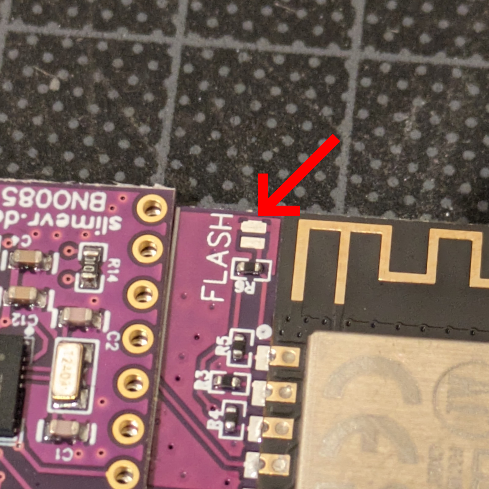

# 官方 DIY 克隆追踪器

由于 SlimeVR 是开源的，因此完全可以基于官方设计文件创建自己的追踪器。
特别是现在 [SlimeVR 商店](https://shop.slimevr.dev)开始销售外壳、线缆和 IMU 等组件！

* TOC
{:toc}

## SlimeVR 商店
不久前，官方 [SlimeVR 商店](https://shop.slimevr.dev)已经开业！
你可以在这里购买替换外壳、线缆甚至 BNO 模块！

## 在哪里找到生产文件

你可以在此处找到主板追踪器、扩展板和 BNO 模块的生产文件：[主板追踪器 PCB](https://oshwlab.com/slimevr/slimevr-main-board)、[扩展板](https://oshwlab.com/eirenliel/slimevr-diy-tracker-extension)和 [BNO 模块](https://oshwlab.com/slimevr/bno085-module)。或者不使用 IMU 模块的最新修订版：[主板追踪器 R14](https://oshwlab.com/slimevr/slimevr-main-tracker)。
这些链接将跳转到相应的 OSHWLab 页面，你可以在那里下载文件或直接在 EasyEDA 在线版中打开。

## 如何从制造商处订购 SlimeVR PCB

打开上述两个链接之一后，你将进入 OSHWLab 网站。在那里，你可以选择"在编辑器中打开"以在 EasyEDA 中访问文件。
**你无需为此过程下载任何软件，因为 EasyEDA 可以在浏览器中运行！**
在 EasyEDA 中打开文件后，你可以查看、编辑或根据你的特定用例进行必要的调整（但对于官方克隆追踪器，这不是必需的）。
接下来，导航到 EasyEDA 顶部栏，在"制造"下，单击"PCB 制造文件（gerber）"。然后，在两个选项上都单击"否"，因为 EasyEDA 尚未配置，并且文件已经准备就绪。
从这里你可以一键下单。
除了表面处理外，你应保持所有设置不变，将其设置为无铅 HASL 或 ENIG！
*你也可以根据需要更改阻焊层的颜色。*
之后，你可以继续订购流程，然后就是等待！

> **注意** 有时当你被重定向到 JLCPCB 时，它可能无法完全加载，这种情况下你可能需要重试。

## 将 IMU 焊接到主 PCB 上

官方追踪器的焊接过程与通常的 DIY 追踪器略有不同。通常 DIY 追踪器通过通孔接线焊接在一起，而 SlimeVR 则使用半孔焊盘。这使得焊接 IMU 非常快速高效。

将 IMU 焊接到主 PCB 需要哪些工具？
- 烙铁
- 无铅焊锡
- 凿形烙铁头（可选但推荐）
- 组装夹具（可选）

说明：
将 IMU 模块放置在主板追踪器 PCB 顶部，如下所示。

现在将 6 个半孔焊盘焊接到主板上，如上图所示。
使用凿形烙铁头可以大大加快并简化此过程。
更多焊接技巧请查看此视频：

<iframe width="100%" height="auto" src="https://www.youtube.com/embed/P0YX_eKyfxA" title="YouTube video player" frameborder="0" allow="accelerometer; autoplay muted; clipboard-write; encrypted-media; gyroscope; picture-in-picture" allowfullscreen></iframe>

## 刷写固件

刷写固件需要：
- 带数据引脚的 USB-C 线缆（推荐使用官方 SlimeVR 线缆）
- 回形针或镊子，用于桥接 PCB 上的连接

这些官方追踪器的固件刷写过程与[刷写 DIY 追踪器](https://docs.slimevr.dev/firmware/index.html)几乎相同。
所有设置已预配置的在线刷写器链接可在此处找到：[点击这里](https://slimevr-firmware.bscotch.ca/?config=eyJib2FyZCI6eyJ0eXBlIjoiQk9BUkRfU0xJTUVWUiIsInBpbnMiOnsiaW11U0RBIjoiMTQiLCJpbXVTQ0wiOiIxMiIsImxlZCI6IjIifSwiZW5hYmxlTGVkIjp0cnVlfSwiaW11cyI6W3sidHlwZSI6IklNVV9CTk8wODUiLCJpbXVJTlQiOiIxNiIsImVuYWJsZWQiOnRydWUsInJvdGF0aW9uIjoiMjcwIn0seyJlbmFibGVkIjp0cnVlLCJ0eXBlIjoiSU1VX0JOTzA4NSIsInJvdGF0aW9uIjoiMjcwIiwiaW11SU5UIjoiMTMifV0sImJhdHRlcnkiOnsidHlwZSI6IkJBVF9FWFRFUk5BTCIsInJlc2lzdGFuY2UiOjE4MCwicGluIjoiMTcifSwidmVyc2lvbiI6IlNsaW1lVlIvbWFpbiJ9。
如果链接不起作用或设置没有正确显示，你可以在本节稍后找到手动设置。
与 DIY 追踪器不同，官方追踪器需要以刷写模式启动。你可以通过桥接 PCB 顶部的焊盘来实现，如下所示：

要进入刷写模式，将追踪器的电源开关向右拨动以打开，将 USB 线缆连接到 PC，然后**在桥接裸露的刷写焊盘的同时**将 USB 线缆连接到 PCB！

追踪器现在应以刷写模式启动，并准备接收固件。

<u>手动刷写设置</u>

如 defines.h 中所述，官方 PCB 的引脚为：

- SDA 14
- SCL 12
- INT 16
- INT_2 13
- Battery_Level 17
- LED_PIN 2
- LED_Inverted True

在使用 BNO085 的官方设置中，两个 IMU 的旋转角度均应设置为 270。

## 最终组装
对于最终组装，请参阅官方 SlimeVR 维修指南。其中包含有关组装和拆卸的信息。另外需要注意的是，粘性泡沫垫通常位于电池的印刷面（在生产单元中）。

<iframe width="100%" height="auto" src="https://www.youtube.com/embed/OxOgkBMEzME?si=jFoO5UXZPsxHKFEr" title="YouTube video player" frameborder="0" allow="accelerometer; autoplay muted; clipboard-write; encrypted-media; gyroscope; picture-in-picture" allowfullscreen></iframe>

<u>书面组装指南</u>

|数量 |零件  |
|:---------:|:----:|
|1x |外壳顶部|
|1x |外壳底部|
|2x |M2.5x10 螺丝或 M2.5x12|
|1x |PCB|
|1x | 电池|
|1x |泡沫垫|
|1x | 贴纸|

将泡沫垫贴在电池中央（文字面）。
将电池线缆连接到 PCB。
通过将开关向右滑动来打开追踪器，确保蓝色 LED 持续闪烁。
通过将开关向左滑动来关闭追踪器！
将 PCB 朝下放入外壳顶部（确保以一定角度插入，端口对齐并平放）。
将电池泡沫面朝 PCB 放置，确保线缆塞入电池下方。
将外壳底部合到已组装的外壳顶部上。
将 m3 螺丝拧入外壳以牢固闭合，注意不要夹到电池线缆！
将贴纸贴在背面。

---
*由 Smeltie 创建*
