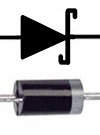
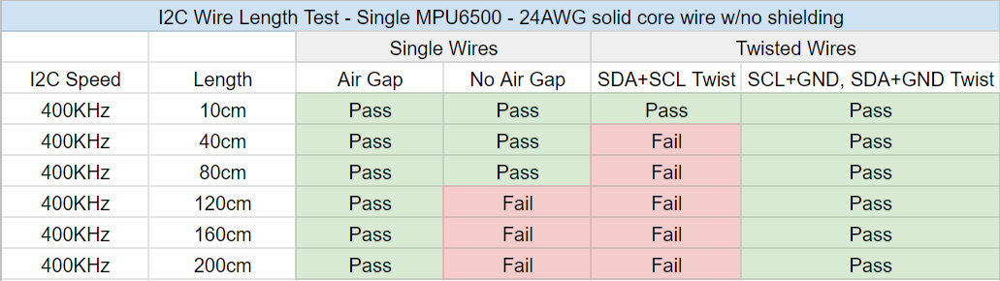
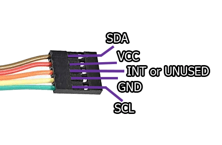
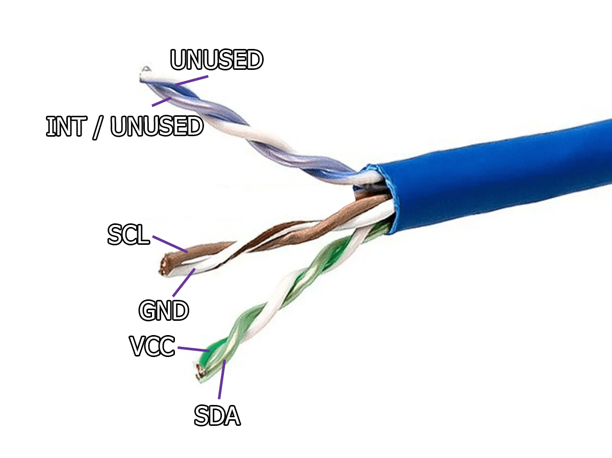

# 追踪器原理图

!!! note
    SPI 是首选的通信协议，具有更好的性能和能效。因此，I2C 可能会逐步淘汰，并且可能在未来固件更新中不再支持。请注意，磁力计目前还不能通过 SPI 使用。

## Wemos D1 Mini

* IMU 排名从最好到最差
  - <input id="ICM45" type="radio" name="d1-imu" value="ICM45" checked="checked"> <label for="ICM45">ICM-45686</label> - 目前最广泛可用的最佳 IMU，比 LSM6DSV 便宜。
  - <input id="DSV" type="radio" name="d1-imu" value="DSV"> <label for="DSV">LSM6DSV</label> - 非常好，比 BNO085 略便宜。
  - <input id="DSR" type="radio" name="d1-imu" value="DSR"> <label for="DSR">LSM6DSR</label> - 不错，比 ICM-45686 和 LSM6DSV 便宜一点。<b>实验性。</b>
  - <input id="bno" type="radio" name="d1-imu" value="bno"> <label for="bno">BNO085</label> - 非常好，但价格昂贵 $$$。<b>不推荐。</b>
  - <input id="bno_ada" type="radio" name="d1-imu" value="bno_ada"> <label for="bno_ada">BNO085（Adafruit）</label> - Adafruit 版本的 BNO085。<b>不推荐。</b>
  - <input id="bmi270" type="radio" name="d1-imu" value="bmi270"> <label for="bmi270">BMI270</label> - 性能略优于 BMI160，但仍然很差。<b>请勿使用！</b>
  - <input id="bmi160" type="radio" name="d1-imu" value="bmi160"> <label for="bmi160">BMI160</label> - 非常便宜，性能同样低下。<b>请勿使用！</b>
  - <input id="mpu" type="radio" name="d1-imu" value="mpu"> <label for="mpu">MPU6050</label> - 便宜，比 BMI160 还差。<b>请勿使用！</b>
  - <input id="mpu9250" type="radio" name="d1-imu" value="mpu9250"> <label for="mpu9250">MPU9250（GY-91）</label> - 比 BMI270 还差，且假货泛滥。<b>请勿使用！</b>
  - <input id="qmc" type="radio" name="d1-imu" value="qmc"> <label for="qmc">MPU6050 + QMC5883L</label> - <b>实验性</b>，更便宜的 MPU9250 等效方案。<b>请勿使用！</b>
* <input id="d1-aux" type="checkbox" name="d1-aux"> <label for="d1-aux">辅助追踪器</label> - 允许连接第二个运动传感器。
* <input id="d1-battery-sense" type="checkbox" name="d1-battery-sense"> <label for="d1-battery-sense">电池检测</label> - 设备能够使用 180k 电阻检测剩余电池电量。
* <input id="d1-charge-diodes" type="checkbox" name="d1-charge-diodes" checked="checked"> <label for="d1-charge-diodes">充电二极管（1N5817）</label> - 允许在充电时使用，是一项**推荐的安全措施**。

  
  注意：如果你使用充电二极管，灰色带应位于上图中箭头尖端所代表的侧面。

| 标签 |  GPIO  |       输入       |    输出    |                     描述                     |
|:-----:|:------:|:----------------:|:-----------:|:--------------------------------------------:|
| A0    | ADC0   | 模拟输入         | 无          | 0 到 3.3v 模拟输入，无输出。                  |
| RX    | GPIO3  | 是               | 仅 RX 引脚  | 启动时为高电平。                              |
| TX    | GPIO1  | 仅 TX 引脚       | 是          | 启动时为高电平。                              |
| D0    | GPIO16 | 无中断           | 无 I2C、PWM | 用于从深度睡眠唤醒芯片，启动时为高电平。      |
| D1    | GPIO5  | 是               | 是          | 常用作 SCL                                    |
| D2    | GPIO4  | 是               | 是          | 常用作 SDA                                    |
| D3    | GPIO0  | 上拉             | 是          | 连接到 Flash 按钮                            |
| D4    | GPIO2  | 上拉             | 是          | 连接到内置 LED，启动时为高电平。             |
| D5    | GPIO14 | 是               | 是          | SPI 接口的 SCLK 引脚                           |
| D6    | GPIO12 | 是               | 是          | SPI 接口的 MISO 引脚                           |
| D7    | GPIO13 | 是               | 是          | SPI 接口的 MOSI 引脚                           |
| D8    | GPIO15 | 下拉至地         | 是          | SPI 接口的 CS 引脚                             |

## 辅助追踪器的线缆布局建议

请注意，虽然原理图显示 SDA 和 SCL 相邻排列，但在辅助追踪器线缆中，请确保它们物理上不相邻。这是为了避免[串扰](https://www.i2cchip.com/i2c_connector.html#Crosstalk)，确保有线连接时两个追踪器稳定运行，并允许扩展线缆安全地超过 80cm。

如果你使用带状线缆或类似布局，请参考以下线缆布局：

如果你使用双绞线或类似布局，请参考以下线缆布局：

*代码由 Carl (<https://github.com/carl-anders>) 整合，图片由 Lune#0241、nwbx01、Meia、Aed 和 Reclusious#2022 制作，感谢整个 DIY 社区的帮助。文档页面集成由 emojikage 完成。由 calliepepper、Aed 和 Amebun 编辑。感谢 snapchat_hotdog 对扩展线缆长度的测试。*

