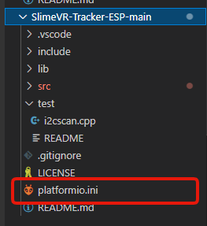
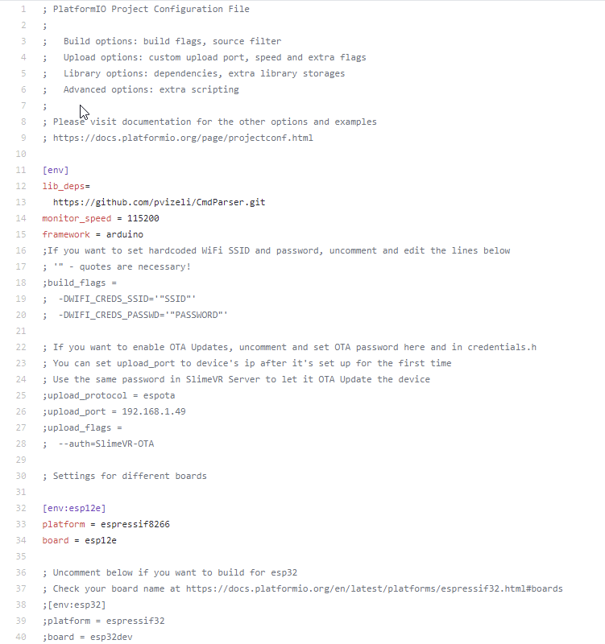
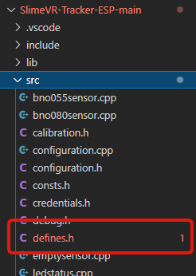
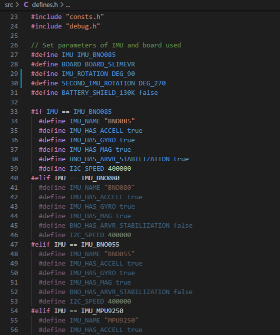
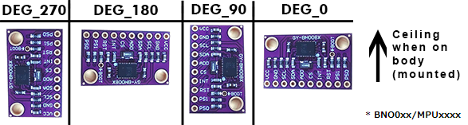
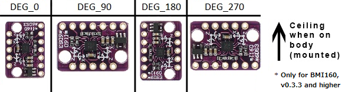

# 配置固件项目

为了构建 SlimeVR 固件并将其上传到追踪器，你需要配置项目以匹配你的特定硬件配置。为此，你需要修改两个文件：`platformio.ini` 和 `defines.h`。

## 目录

* TOC
{:toc}

## 1. 配置 platformio.ini

`platformio.ini` 文件指定了有关 MCU 的信息。

该文件可以在项目的根目录中找到：



`platformio.ini` 文件的内容应如下所示：



### 选择你的硬件设置

#### 监视器速度

此字段设置 VSCode 中的串行监视器速度 `monitor_speed = 115200`。如果你的板卡数据手册和文档建议更改，请修改此值，但默认值应该可用。

**对于 platform 和 board 字段，请访问 [PlatformIO 板卡文档](https://docs.platformio.org/en/latest/boards/index.html)并找到你的板卡。如果不在其中，请保留默认值或在 [SlimeVR Discord](https://discord.gg/SlimeVR) 中询问。**

#### env

> **重要：** 其他 env 行必须用前导分号（`;`）注释掉。

如果你使用的是基于 ESP8266 的板卡，请取消注释以下行：

```ini
[env:esp12e]
platform = espressif8266
board = esp12e
```

如果你使用的是基于 ESP32 的板卡，请取消注释以下行：

```ini
[env:esp32]
platform = espressif32
board = esp32dev
```

#### WiFi

如果你在通过服务器设置 Wi-Fi 凭据时遇到问题，可以将 Wi-Fi 凭据硬编码到固件中。

要硬编码 Wi-Fi 凭据，请取消注释以下行，并将 `SSID` 和 `PASSWORD` 替换为相应的 Wi-Fi 凭据：

```ini
  -DWIFI_CREDS_SSID='"SSID"'
  -DWIFI_CREDS_PASSWD='"PASSWORD"'
```

如果你在让追踪器连接到 Wi-Fi 时遇到问题，请查看以下故障排除步骤：

- 如果你的 Wi-Fi 密码包含 `%` 字符，请将其替换为 `%%`。
- 如果你的网络 SSID 包含非字母数字字符，追踪器可能无法连接。
- ESP8266 和 ESP32 仅支持 2.4GHz 网络频段。

## 2. 配置 defines.h

`defines.h` 文件指定了有关 IMU 和 MCU 的信息。

该文件可以在项目的 `src` 目录中找到：



你可以[手动](#configuring-definesh-manually)编辑 defines.h 文件，或使用下面的工具生成文件内容。

### 自动配置 defines.h

选择你如何构建 SlimeVR 追踪器：

<dl id="defines_config"></dl>

选择上述设置后，你可以：
- 使用下面的下载按钮并替换你的 defines.h 文件。
- 将下方文本字段中的内容复制并粘贴到你的 IDE（如 VSCode）中。

<a class="btn btn-purple" id="defines_download">下载 defines.h</a>

<div class="language-plaintext highlighter-rouge"><div class="highlight"><pre class="highlight"><code id="defines_code"></code></pre></div></div>

如果你已使用上述工具，则 defines.h 文件配置完成。

### 手动配置 defines.h

你也可以手动配置 defines.h 文件，而不是使用上述工具。在做出任何更改之前，`defines.h` 文件的内容应如下所示：



#### 选择你的硬件设置

首先，你需要更改以下行来定义你的 IMU 型号和 MCU：

```c
// 设置 IMU 和使用的板卡的参数
#define IMU IMU_BNO085
#define BOARD BOARD_SLIMEVR
#define IMU_ROTATION DEG_90
#define SECOND_IMU_ROTATION DEG_270
#define BATTERY_SHIELD_130K false
```

##### 更改 IMU 型号

以下行定义了使用哪个 IMU：

```c
#define IMU IMU_BNO085
```

要更改 IMU 型号，请根据你的 IMU 型号将 `IMU_BNO085` 替换为以下值之一：

```
IMU_BNO080
IMU_BNO055
IMU_MPU9250
IMU_MPU6500
IMU_MPU6050
IMU_BNO086
IMU_ICM20948
IMU_BMI160
IMU_BMI270
```

如果你使用的是 MPU+QMC5883L，请将 IMU 设置为 `IMU_MPU9250`。请注意，你需要使用 QMC 固件才能工作，因为主固件不支持 MPU+QMC5883L。

##### 更改板卡型号

以下行定义了使用哪个 MCU 板卡：

```c
#define BOARD BOARD_SLIMEVR
```

要更改板卡型号，你必须将 `BOARD_SLIMEVR` 替换为以下可能的值之一：

* 对于大多数基于 ESP8266 的板卡，设置为 `BOARD_NODEMCU`。对于 Wemos D1 Mini，可以使用 `BOARD_WEMOSD1MINI`。
* 对于基于 ESP32 的板卡，设置为 `BOARD_WROOM32`。
* 对于不遵循任何已定义板卡引脚定义的板卡，设置为 `BOARD_CUSTOM` 并自行定义引脚。

##### 调整 IMU 板卡旋转

以下行定义了 IMU 板卡的旋转：

```c
#define IMU_ROTATION DEG_90
#define SECOND_IMU_ROTATION DEG_270
```

要更改 IMU 板卡旋转，请将 `DEG_90`（以及如果你有辅助 IMU 则将 `DEG_270`）替换为以下值之一。此图片的顶部为天花板（或你的头部），IMU 在安装在身体上时背朝你。





##### 设置电池监控选项

以下行定义了如何读取电池电压：

```c
#define BATTERY_MONITOR BAT_EXTERNAL
#define BATTERY_SHIELD_RESISTANCE 180
```

如果你没有用于检测追踪器电池百分比的 180 kOhm 电阻，请将 `BAT_EXTERNAL` 替换为 `BAT_INTERNAL`。设置为 `BAT_INTERNAL` 时，追踪器只能判断电池电量低，并会导致微控制器上的 LED 反复闪烁。如果你有 180 kOhm 电阻，则无需更改 `BAT_EXTERNAL`。如果你有非 180 kOhm 的电阻值，只需将 `180` 改为你的电阻值（以 kOhm 为单位），例如如果你的电阻是 130 kOhm，则改为 `130`。如果你有 Wemos 电池保护板产品，则按照上述说明将 `180` 改为 `130`。

#### 定义所选板卡的引脚

你只需更改 `#elif` 符号之间与所选板卡对应的部分。如果你使用 VSCode，所选板卡部分将高亮显示，而其他部分将变灰。

**示例 1：**

```c
#elif BOARD == BOARD_NODEMCU || BOARD == BOARD_WEMOSD1MINI
  #define PIN_IMU_SDA D2
  #define PIN_IMU_SCL D1
  #define PIN_IMU_INT D5
  #define PIN_IMU_INT_2 D6
  #define PIN_BATTERY_LEVEL A0
  #define BATTERY_SHIELD_130K true
```

**示例 2：**

```c
#elif BOARD == BOARD_WROOM32
  #define PIN_IMU_SDA 21
  #define PIN_IMU_SCL 22
  #define PIN_IMU_INT 23
  #define PIN_IMU_INT_2 25
  #define PIN_BATTERY_LEVEL 36
  #define BATTERY_SHIELD_130K true
```

**示例 3：**

```c
#elif BOARD == BOARD_CUSTOM
  // 根据上面的示例定义引脚
  #define PIN_IMU_SDA 5
  #define PIN_IMU_SCL 4
  #define PIN_IMU_INT 14
  #define PIN_IMU_INT_2 13
  #define PIN_BATTERY_LEVEL A0
```

主追踪器和辅助追踪器的 SDA 和 SCL 引脚总是相同的。你可以使用引脚名称（如 `D1`）或引脚编号（如 `21`）来定义引脚。请查阅你的板卡引脚图了解详情，或者将追踪器连接到默认引脚，这些是推荐的引脚。

你需要在此处放置 I2C 所选引脚。请查阅引脚图了解哪些端口可用于 I2C。

```c
  #define PIN_IMU_SDA D2
  #define PIN_IMU_SCL D1
```

如果你使用 BNO，则需要定义 INT 引脚：

```c
  #define PIN_IMU_INT D5
```

如果你使用第二个 BNO，则需要为第二个 BNO 定义 INT 引脚，它必须是另一个引脚：

```c
  #define PIN_IMU_INT_2 D6
```

如果你使用电阻来检测电池电量，则需要选择一个支持模拟输入的引脚：

```c
  #define PIN_BATTERY_LEVEL A0
```

你的 MCU 和 IMU 配置的固件现在应该已经完成！

*由 adigyran 在 Musicman247#1341 的帮助下创建，由 nwbx01 编辑，由 calliepepper 和 emojikage 编辑并设计样式*

<script src="../assets/js/configuring-defines.js"></script>
