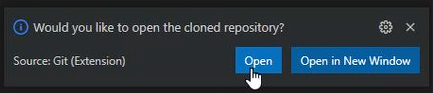
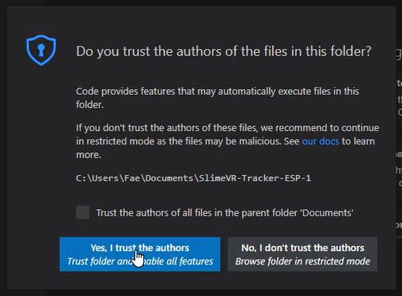

# 设置环境

本步骤将展示如何准备系统以将固件上传到追踪器。

## 1. 安装 Visual Studio Code

下载[最新的 Visual Studio Code](https://code.visualstudio.com/download) 并安装。

	<video name="下载 Visual Studio Code" autoplay muted loop controls playsinline>
	  <source src="../assets/videos/downloadVSC.webm" type="video/webm">
	  <source src="../assets/videos/downloadVSC.mov" type="video/quicktime">
	</video> 
	选择正确的环境

	<video name="安装 Visual Studio Code" autoplay muted loop controls playsinline>
	  <source src="../assets/videos/installVSC.webm" type="video/webm">
	  <source src="../assets/videos/installVSC.mov" type="video/quicktime">
	</video> 
	按照安装过程操作

## 2. 安装 PlatformIO IDE

安装 Visual Studio Code 后，打开它并安装 [VSCode 的 PlatformIO IDE](https://marketplace.visualstudio.com/items?itemName=platformio.platformio-ide)，这是一个允许你连接到追踪器、构建和上传固件的扩展。

	<video name="安装 PlatformIO" autoplay muted loop controls playsinline>
	  <source src="../assets/videos/installPIO.webm" type="video/webm">
	  <source src="../assets/videos/installPIO.mov" type="video/quicktime">
	</video> 

## 3. 安装设备驱动程序

**请注意：如果你下载并运行 SlimeVR 服务器，这些驱动程序将自动安装。**

### 针对 CH340（NodeMCU v3、Wemos D1 Mini 和官方 SlimeVR 追踪器）

从[此处](https://cdn.sparkfun.com/assets/learn_tutorials/8/4/4/CH341SER.EXE)下载 `CH341SER.EXE` 文件，运行并按照安装说明操作。

	<video name="CH341SER 安装向导" autoplay muted loop controls playsinline>
	  <source src="../assets/videos/installCH.webm" type="video/webm">
	  <source src="../assets/videos/installCH.mov" type="video/quicktime">
	</video> 

### 针对 CP210X（NodeMCU v2）

1. 从 silicon labs [此处](https://www.silabs.com/documents/public/software/CP210x_Windows_Drivers.zip)下载包含驱动程序的 zip 存档。

   对于其他操作系统，驱动程序可在此[此处](https://www.silabs.com/developers/usb-to-uart-bridge-vcp-drivers)找到。

2. 解压下载的 zip 存档中的文件，然后运行 `CP210xVCPInstaller_x64.exe`（如果使用 32 位 Windows，则运行 `CP210xVCPInstaller_x86.exe`）并按照安装说明操作。

## 4. 安装 Git 客户端

对于 Windows，你可以下载并安装 [Git for Windows](https://git-scm.com/download/win)。如果你使用其他操作系统，请访问 [https://git-scm.com/downloads](https://git-scm.com/downloads)。

	<video name="安装 Git for Windows" autoplay muted loop controls playsinline>
	  <source src="../assets/videos/installGit.webm" type="video/webm">
	  <source src="../assets/videos/installGit.mov" type="video/quicktime">
	</video> 
   注意：你可能需要点击"Click here to download manually"。如果不起作用，可以尝试<a href="https://gitforwindows.org/">此处</a>。

## 5. 选择固件版本

某些硬件配置可能需要不同版本的固件。

对于大多数追踪器，使用 `https://github.com/SlimeVR/SlimeVR-Tracker-ESP.git` 即可。

对于 MPU+QMC5883L 追踪器，你需要使用 `https://github.com/deiteris/SlimeVR-Tracker-ESP.git`。

## 6. 克隆固件项目

在进行下一步之前，请确保关闭当前打开的任何项目，或打开一个新窗口。

1. 单击**源代码控制**按钮，单击**克隆仓库**，然后输入第 5 步中选择的固件版本链接。

   如果在 Visual Studio Code 打开时安装了 Git，你可能需要先关闭并重新打开它。

   

      <video name="VSC 中的克隆过程" autoplay muted loop controls playsinline>
       <source src="../assets/videos/cloneVSC.webm" type="video/webm">
       <source src="../assets/videos/cloneVSC.mov" type="video/quicktime">
      </video> 
   

2. 选择下载位置后，单击右下角出现的**打开按钮**。

   

3. 单击**是，我信任作者**。

   

4. **（仅限 MPU+QMC5883L）** 单击**源代码控制**按钮，单击**main**，然后根据你使用的是 QMC5883L 还是 HMC5883L，从下拉菜单中选择 **qmc-mag-new** 或 **hmc-mag**。

   

      <video name="找到 MPU+QMC5883L 的更改位置" autoplay muted loop controls playsinline>
       <source src="../assets/videos/MPUChanges.webm" type="video/webm">
       <source src="../assets/videos/MPUChanges.mov" type="video/quicktime">
      </video> 
   

