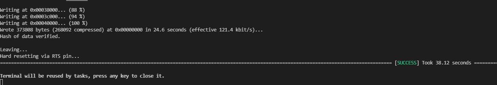
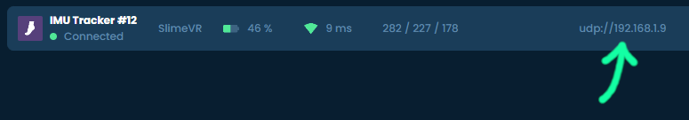

# 构建和上传固件

上传固件最初必须通过线缆完成。一旦追踪器在首次固件更新后连接到 Wi-Fi，你可以在将来选择使用 OTA 方式。

## 1. 将追踪器连接到电脑

如果你的微控制器板卡有标记为 `FLASH`、`BOOT` 或 `RESET` 的按钮，请按住该按钮并插入 micro-USB 线缆。如果你有不同的标签和/或按钮，请查看微控制器的手册以获取更多信息。

注意，Wemos D1 Mini 不需要按住按钮。

## 2. 构建固件

1. 按照[配置固件项目页面](configuring-project.md)准备项目以构建和上传固件。
2. 按下 Visual Studio Code 底部的构建按钮。

## 3. 上传固件

* 如果你使用 OTA 方法，首先确保要刷写的追踪器已开启。

* 固件构建完成后，按上传按钮上传固件。

* 如果上传成功，你应该会看到类似以下的输出：

  

恭喜！你现在已成功将固件上传到你的 SlimeVR 追踪器！

如果通过线缆上传固件时遇到问题，请检查以下内容：
1. 确保追踪器的 USB 线缆已牢固插入电脑。
2. 确保你的 USB 线缆是数据和充电线缆（建议尝试其他线缆或设备测试线缆）。
3. 确保驱动程序是最新的。

此外，这可能是由软件占用 COM 端口导致的（**VSCode 和 Cura 可能是原因**）。

## 通过 OTA 上传

一旦成功将追踪器连接到 Wi-Fi，你就可以使用 OTA 来处理所有未来的固件更新。

1. 获取要刷写的追踪器的 IP 地址。IP 可以通过网络监控应用程序找到，或从 SlimeVR 服务器复制，如下图所示：<br>
  
2. 在 `platformio.ini` 文件中，通过移除 `;` 取消注释 Visual Studio Code 中的以下行：
  ```ini
  ;upload_protocol = espota
  ;upload_port = 192.168.1.49
  ;upload_flags =
  ;  --auth=SlimeVR-OTA
  ```
3. 将 upload_port 的值更改为第一步获取的 IP 地址（如果从 SlimeVR 服务器获取，只需复制第二个和第三个 `/` 之间的 4 个数字，在上面的示例图片中为 192.168.1.109）。
4. 将要刷写的追踪器关闭再重新打开。
5. 等待追踪器重新连接到服务器。
6. 按上传按钮上传固件。
7. 上传达到 100% 后，等待追踪器再次重新连接到服务器。过早关闭设备可能导致更新不完整（变砖，直到通过 USB 上传新固件）。
8. 根据需要为尽可能多的追踪器重复此过程。

## 故障排除

如果在执行这些步骤时遇到问题，请查看[常见问题](../user-guide/common-issues.md)页面。

如果在那里找不到问题的答案，请在 [discord](https://discord.gg/slimevr) 的 **#diy** 频道中提问，我们很乐意提供帮助。

*由 prohurtz、adigyran、eiren 和 calliepepper 精心制作。由 calliepepper、emojikage、nwbx01 和 nullstalgia 编辑。*
