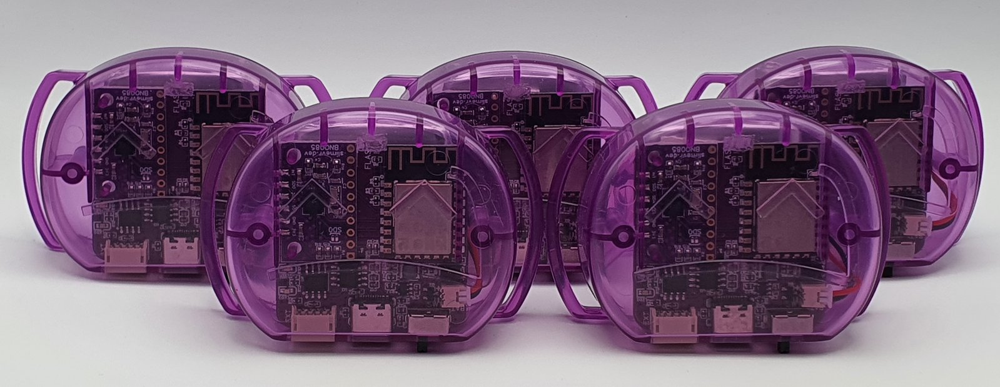
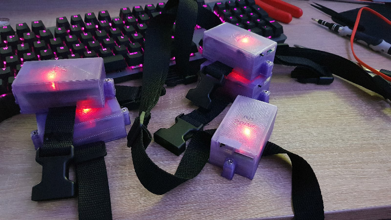

# SlimeVR 文档

欢迎阅读 SlimeVR 文档。本网站涵盖如何[自行构建 SlimeVR 追踪器](diy/index.md)、[安装或更新现有追踪器的固件](firmware/index.md)、[安装和配置 SlimeVR 服务端](server/index.md)，并[提供大量社区构建的工具](tools/index.md)。

## 什么是 SlimeVR？

SlimeVR 是一套开源软硬件传感器系统，旨在实现虚拟现实中的全身追踪 (FBT)。该项目围绕创建一套可根据每个用户需求完全定制的系统这一核心理念而构建。本文档详细介绍了如何设置预构建追踪器，以及构建兼容的 DIY SlimeVR 追踪器的指南。有关 SlimeVR 工作原理的更详细说明，请查看 [SlimeVR 101](user-guide/slimevr101.md)。

## 我有预构建追踪器，现在该做什么？

欢迎新 SlimeVR 用户，很高兴你来到这里！对于最简单的设置流程，建议你访问我们的[快速设置指南](user-guide/quick-setup.md)。

## 如何获得 SlimeVR 追踪器？

目前有几种方法可以组建你自己的 SlimeVR FBT 解决方案。

!!! note
    要实现完整的全身追踪 (FBT)，至少需要 5 个 SlimeVR 追踪器。或者，如果你只想测试部分追踪而不投资全套设备，可以购买或构建单个仅用于胸部追踪的追踪器。其他方式（如使用手机或 Joy-Con）也存在，但追踪质量受到特定设备的严重限制，因此效果会明显较差。

### 1. 购买追踪器

#### 从 SlimeVR 直接购买完整构建的追踪器

完整构建的追踪器可在 [Crowd Supply](https://www.crowdsupply.com/slimevr/slimevr-full-body-tracker) 上预购。这些追踪器是 SlimeVR 核心成员的热情项目，由于芯片短缺、运输延迟等原因，我们无法保证发货日期或周转时间。

此选项为预购。请查看产品页面了解新订单的预计发货时间。实际发货时间可能因生产延迟和其他情况而有所不同。

### 2. 第三方卖家

第三方卖家很常见，在 [SlimeVR Discord](https://discord.gg/SlimeVR) 市场论坛上提供预构建追踪器和定制委托。设计和规格因卖家而异，因此请务必确认你具体获得的是什么。

由于每个 SlimeVR 追踪器最重要的两个方面是 IMU（用于测量运动）和通信协议（追踪器如何与你的设备通信），建议查看 [IMU 对比页面](diy/imu-comparison.md)以了解可用追踪器的性能预期。

!!! warning
    SlimeVR 无法保证非市场的第三方追踪器符合任何特定的质量要求。请知悉，从第三方卖家购买等同于从小型创作者处购买，自行研究这些追踪器的质量非常重要。建议查看评价或与曾向该卖家购买的其他人交流。如果你的任何第三方追踪器出现故障，请联系卖家寻求支持。但是，你可能需要具备一定的焊接和追踪器组装知识才能自行维修。

**注意：** 要实现完整的全身追踪 (FBT)，至少需要 5 个追踪器。或者，如果你只想测试部分追踪而不投资全套设备，可以构建或购买单个仅用于胸部追踪的追踪器。其他方式（如使用手机或 Joy-Con）也存在，但追踪质量受到特定设备的严重限制，因此效果会明显较差。

### 3. 自行构建追踪器

#### 完全从零开始

 
*由 NightyIceC00kie 构建的示例*

自行构建追踪器是目前获取 SlimeVR 追踪器最便宜的方法。本文档提供了从零开始构建追踪器的完整指南，包括所需全部组件的清单、购买地点以及大多数 IMU 和微控制器组合的原理图。

组装 SlimeVR 追踪器最常见的方式是将多个 PCB 焊接到一块载板上。

- 对于基于 Wi-Fi 的追踪器（"大"或"标准"追踪器），可[在此](diy/index.md)查看组件和组装指南。
- 对于 nRF（"Smol"）追踪器，可[在此](smol-slimes/index.md)查看组件和组装指南。

基于 PCB 的构建方式也经常使用，可通过 JLCPCB 或其他供应商以低成本制造。这些电路板可以大大简化流程并减少所需的焊接量。许多流行的选项可用，附有说明和 3D 可打印文件：[社区外壳](diy/cases.md)

DIY 构建需要时间组装，并可能需要不时自行维修。

> 请注意：如果你正在寻找 ICM-45686（推荐的 IMU），SlimeVR 商店有[可用模块](https://shop.slimevr.dev/products/slimevr-mumo-breakout-module-v1-icm-45686-qmc6309)。

#### 在 Crowd Supply 购买官方 DIY 套件

 
*DIY 套件电路板和线材的样机。*

你可以购买[**官方 DIY 套件**](https://www.crowdsupply.com/slimevr/slimevr-full-body-tracker#products)，其中包含电路板、延长线和线缆。它不包括外壳、绑带、电池或其他配件，这些需要单独购买。更多信息请参阅 [DIY 套件指南](diy/diy_kit_guide.md)。

此选项需要很少或不需要焊接，提供经过测试的电路板，使用最佳可用的 IMU，允许紧凑设计，并且是完整 SlimeVR 追踪器更实惠的替代方案。它还允许你定制外壳和绑带。

示例：[TinyOfficial-Case](https://github.com/ZRock35/TinyOfficial-Case)

然而，虽然成本显著降低，但此选项仍然是预购。建议同时购买电池和其他所需部件以避免延误。

请查看产品页面和 Discord 了解预计发货时间。实际发货时间可能因生产延迟和其他情况而有所不同。

### 4. 替代追踪方案

由于 SlimeVR 是开源的，并且源于实验和探索的理念，已经出现了其他替代定制构建追踪器的方案。这包括：

- 使用[手机代替追踪器](tools/owoTrack.md)。
- 使用[Nintendo Joy-Con 代替追踪器](tools/slimevr-wrangler.md)。
- 使用[Mocopi 追踪器与 SlimeVR 服务端](https://www.sony.net/Products/mocopi-dev/en/documents/beta/HowToBetaFunctions_SlimeVR.html)
- 使用[HaritoraX 追踪器与 SlimeVR 服务端](tools/slimetora.md)

**请注意，这些方案可能与真正的 SlimeVR 追踪器相比效果欠佳，但对于实验很有用，并且在某些情况下可以正常工作。建议不要大量投资购买旧手机或 Joy-Con，因为大多数使用这些方案的用户仅将其视为临时替代方案。**

请注意，这些方案因品牌和型号而异（例如，第三方 Joy-Con 几乎无法使用）。用户通常会遇到连接稳定性、应用程序崩溃和其他限制的问题。手机或 Joy-Con 绑带也需根据物体的形状、尺寸和安装位置单独配置。

如果你遇到任何问题，欢迎在 [SlimeVR Discord](https://discord.gg/SlimeVR) 上联系我们。

*由 adigyran 和 calliepepper 编写；由 QuantumRed#0001、calliepepper、Spazzwan、emojikage、nwbx01 和 tomyum3dp 编辑；由 calliepepper 设计样式。由 Amebun 重新格式化和重写，以符合 2025 年 12 月的标准。*
