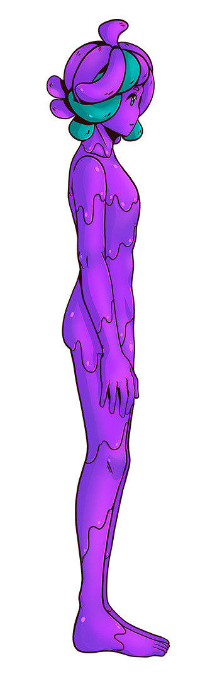
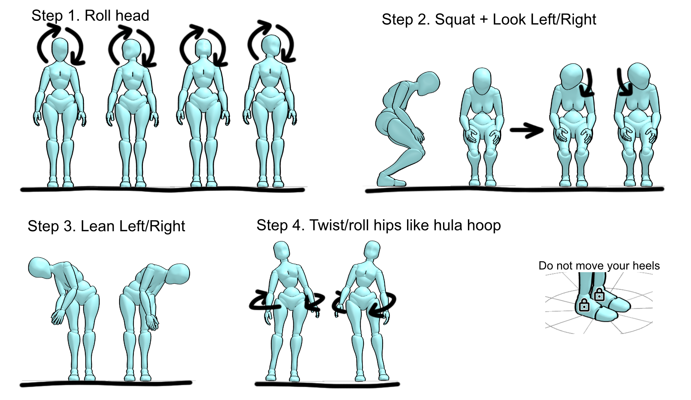

# 身体比例配置

SlimeVR 使用一个虚拟骨架，根据从追踪器接收的数据计算位置。作为设置过程的一部分，这个骨架是使用您身体各部位的真实测量值（以厘米为单位）构建的，以便 SlimeVR 能够精确计算与您真实身体匹配的骨架。
虽然这些值可以直接输入到 SlimeVR 服务器中，但建议您使用 AutoBone 系统。完成自动配置过程后，也建议使用上述测量值来确认准确性，然后再确定自动数值。您还可以选择[在 VR 内进行视觉检查](#手动配置身体比例)，在本页面底部有描述。

## 测量值

<table class="bpTable">
   <tr>
      <td>
         
      </td>
      <td>
         <details>
            <summary id="ho">头部偏移</summary>
            头部偏移值是从您的头显到头部中心的大致距离。
         </details>
         <details>
            <summary id="nl">颈长</summary>
            颈长值是从头部中心到肩部的大致距离。
         </details>
         <details>
            <summary id="chest">上胸长度（估计 12-20）+ 胸部长度（估计 12-20）</summary>
            胸部长度大致是从颈部末端到胸部末端的距离。
            当使用单个胸部追踪器时，两个值的总和才重要。
            当使用两个胸部追踪器时，SteamVR 追踪器仍将根据单个胸部追踪器计算，但脊柱的其余部分将使用两个追踪器的数据。
         </details>
         <details>
            <summary id="waist">腰部长度（估计 20-35）</summary>
            腰部长度是从胸部到臀部的距离减去您设置的髋部长度。例如，如果您的胸部到臀部的距离是 30，而您的髋部长度是 5，那么您的腰部长度就是 25。
         </details>
         <details>
            <summary id="hip">髋部长度（估计 2-6）</summary>
            该长度用于计算髋部运动，可以尝试调整，但应在 2 到 6 之间。
         </details>
         <details open="">
            <summary id="hw">髋部宽度</summary>
            髋部宽度值是您两侧股骨之间的距离。
         </details>
         <details>
            <summary id="ul">大腿长度（估计 35-60）</summary>
            大腿长度是从髋部到膝盖的距离。
         </details>
         <details>
            <summary id="ll">小腿长度（估计 45-65）</summary>
            小腿长度是从膝盖到脚踝的距离。
         </details>
         <details>
            <summary id="foot">脚长</summary>
            脚长值是您脚的长度，从脚踝到脚尖。
         </details>
         <details>
            <summary id="offsets">髋部偏移 / 胸部偏移 / 脚部偏移</summary>
            如果您的人物模型具有非人类或不寻常的比例，这些值会偏移实际追踪器相对于虚拟追踪器的位置。一个很好的例子是，为具有趾行动物腿的人物模型更改脚部偏移，脚部可能需要更靠外或更靠后，或者根据人物模型的视角来便于校准。<br>
            这也可能用于补偿游戏对追踪器的特定期望。增大数值会使偏移向下（胸部、髋部）或向前（脚部）。
         </details>
         <details>
            <summary id="skelloffsets">骨架偏移</summary>
            骨架偏移值会将所有追踪器从其物理位置向前（正值）或向后（负值）偏移。除非需要，否则可以保持不变。
         </details>
      </td>
   </tr>
</table>

## AutoBone / 自动身体比例校准

AutoBone（也称为"自动身体比例校准"）通过记录用户运动并自动计算骨骼长度，免去了手动输入骨骼长度的需要。AutoBone 可在 GUI 的"身体比例"选项卡下以"自动校准"方式使用。

这免去了手动设置骨骼长度的需要，但如果需要，仍然可以手动微调数值。

### 使用方法

!!! warning
    - 请确保在此过程中头显已开启并戴在头上。
    - 如果您使用的是独立头显，请记得启用 Guardian/边界，否则 SlimeVR 无法正确获取您的身高。
    - 在录制过程中，您**必须**保持脚跟在同一位置，否则结果值将无效。

#### 文字指南

要使用 AutoBone，请按照以下步骤操作：

1. 在遵循以下任何说明之前，请确保：
   - 您至少有足够的追踪器来追踪脚部（通常 5 个追踪器）。
   - 您已佩戴好追踪器和头显。
   - 您的追踪器和头显已连接到 SlimeVR 服务器并且工作正常（例如，没有卡顿、断开连接等问题）。
   - 您的头显正在向 SlimeVR 服务器报告位置数据（这通常意味着 SteamVR 正在运行并通过 SlimeVR 的 SteamVR 驱动连接到 SlimeVR）。
   - 您的追踪器和头显在 SlimeVR 服务器内追踪正常（例如，安装设置正确，您已执行完整重置，踢腿、弯腰、坐下时腿部方向正确等）。
2. （可选）重置比例以设置基线（自 v0.9.0 起，GUI 中的身高步骤已涵盖此操作）：
   1. 导航到"身体比例"选项卡，确保您处于"自动校准"而非"手动校准"。
   2. 站直并按下 **"重置所有比例"** 按钮。
3. 按照 GUI 上显示的步骤操作。
4. 在录制期间确保脚跟保持在地面上且在同一位置。
5. 按下 **"开始录制"** 按钮，GUI 将指示录制已开始。录制将持续约 30 秒。
6. **移动**，直到按钮上的文字变回"开始录制"，目前已知的最佳校准动作如下，每完成一步后恢复站直：
   1. 站直，头部做圆周运动，使鼻子在面向前方时画出一个硬币大小的圆圈。
   2. 背部前倾并下蹲。下蹲时，向左看，然后向右看。
   3. 将上半身向一侧倾斜，然后向另一侧倾斜。
   4. 臀部做与髋部同宽的圆周运动，就像在呼啦圈一样。
   5. 如果录制还有剩余时间，您可以重复这些步骤直到结束，或者站着等待。
6. 录制完成后，SlimeVR 将处理录制数据。处理完成后，您将能够看到新的身体比例数值（以厘米为单位）。
7. 要使用计算出的数值，请按下 **"它们是正确的"** 按钮。如果数值看起来不正确，您可以使用"重新录制"按钮再次尝试录制——录制将立即开始，请确保您已做好准备。
8. 完成后请务必点击回到 SlimeVR 服务器的"主页"选项卡，以重新启用地面检测和腿部微调增强功能。

#### 校准动作的视觉参考

<div class="embeddedVideo">
   <video name="AutoBone 视觉参考" autoplay muted playsinline loop controls>
      <source src="../assets/videos/AutoBone_Visual_Reference.webm" type="video/webm">
      <source src="../assets/videos/AutoBone_Visual_Reference.mov" type="video/quicktime">
   </video><br>
   视频示例由 ZRock35 录制。
</div>



### 常见问题 / 调试

如果您在使用 AutoBone 时遇到问题：

- 确保在录制时脚跟保持在相同位置，不要抬腿或走动。
- 确保头显没有延迟、冻结或瞬移（使用 SteamVR 的桌面视图开始录制，而非 Virtual Desktop）。
- 再次检查追踪器是否正确安装并正常工作。
- 确保 AutoBone 中"检查身高"步骤的身高与您自己的身高一致。HMD 高度应低于您的实际身高，因为它应在您的眼睛高度附近。报告的"实际身高"并不重要，不会影响此过程。
- 如果您的实际身高显示不正确，重新绘制 Guardian 或重置您的游玩空间地面通常可以解决问题。

如果这些方法都没有帮助，您可以在 [SlimeVR Discord](https://discord.gg/SlimeVR) 的 [#support-forum](https://discord.com/channels/817184208525983775/1025104406393405491) 或 [#technical-support](https://discord.com/channels/817184208525983775/878727840118505533) 频道中寻求帮助。

为了帮助在 SlimeVR Discord 中进行调试，您可以在寻求帮助时发送录制文件。录制文件包含您所有追踪器的信息，以帮助重现您的设置，并包括您所做的任何动作，但不包含个人身份信息。如果您愿意分享追踪器数据，您可以在 "`%AppData%\dev.slimevr.SlimeVR\AutoBone Recordings`" 找到录制文件。最近的录制会自动保存为 "`LastABRecording.pfr`"，任何手动保存的录制文件将命名为 "`ABRecording1.pfr`"、"`ABRecording2.pfr`" 等，数字越大表示越新。

有关 AutoBone 工作原理的更多信息，请查看 [AutoBone 的工作原理](#autobone-的工作原理)。

## 手动配置身体比例

所有配置都可以从 SteamVR 仪表板或在 VRChat 内（在镜子前）进行。按 `+` 或 `-` 按钮更改长度，所有长度均以厘米为单位。按下 **重置所有比例** 将根据 HMD 的当前高度将值更改为默认值。建议在您习惯使用 SlimeVR 之前使用默认比例，以及用于测试目的。

在执行此操作之前，请确保[正确安装](putting-on-trackers.md)了追踪器，因为这会影响您的结果。

您可以在 VRChat 中使用镜子查看追踪器的位置。但是，请将 SteamVR 追踪器的位置与真实关节的位置进行比较，而不是与 VRChat 人物模型的关节位置进行比较。

或者，您可以在 SteamVR 中使用 [SlimeVR Overlay](https://github.com/SlimeVR/SlimeVR-Rust#installation) 来可视化您的骨骼。

请确保从上到下调整数值。

##### 头部偏移（8-12）

左右摇晃头部，就像在表示不同意一样。调整头部偏移，直到任何移动可以忽略不计。所有追踪器应保持不动。

##### 颈长（8-14）

上下移动头部，就像在点头一样，或者像一只可爱、困惑的小狗一样左右倾斜头部。调整颈长，直到任何移动可以忽略不计。所有追踪器应保持不动。

##### 上胸长度（12-20）+ 胸部长度（12-20）

修改数值，直到您的 SteamVR 胸部追踪器大约位于脊柱中部。

- 如果您只有一个胸部追踪器，更改两个值中的哪一个并不重要，只有它们的总和起作用。
- 如果您有两个胸部追踪器，在调整髋部和腰部长度后调整它们的比例，以便在移动胸部时您的脊柱最稳定。

##### 髋部长度（2-6）

首先将其设置在 2 到 6 之间，可能需要根据设置所有其他数值后观察到的运动情况进行实验和更改。如果增加此值，必须等量减少腰部长度值。

##### 腰部长度（20-35）

修改数值，直到您的 SteamVR 腰部/髋部追踪器与您的髋骨对齐（您可以使用控制器来对齐真实髋部和追踪器）。

##### 大腿长度（35-65）

修改直到您的 SteamVR 膝盖追踪器位于您的膝关节处。

##### 小腿长度（45-60）

修改直到您的 SteamVR 脚部追踪器位于脚踝高度。

##### 脚部（使用脚部扩展时）

将"脚长"设为 0，更改"脚部偏移"（默认为 -5），直到在 T-Pose 校准时脚部追踪器位于您人物模型脚踝内部，或在同一水平线上，然后将"脚长"设回 5。

##### 髋部宽度（26-32）

默认值即可。可以尝试调整以使您的腿部追踪器在重置时对齐，但不要以阻止腿部交叉为目的增加此值。

##### 髋部偏移和胸部偏移

保持为 0，除非您的人物模型或应用程序/游戏有特定问题。

##### 骨架偏移（0）

保持为 0，除非您的人物模型有特定问题。

##### 肩部距离（4-10）和肩部宽度（30-42）

将上臂长度设为 0，调整数值直到肘部追踪器位于您的肩膀上。

##### 上臂/前臂距离（20-35）

调整使 SteamVR 追踪器位于您的肘部。

##### 控制器距离 Z（10-20）和控制器距离 Y（2-8）

旋转手腕并调整，直到肘部追踪器滑动最少。

##### 肘部偏移（0）

保持为 0，除非您在使用下臂 + 上臂追踪或肘部追踪器绑定到胸部时遇到手臂追踪问题。

## AutoBone 的工作原理

AutoBone 通过记录运动数据并快速模拟该运动，同时逐步调整骨骼长度来工作。在调整骨骼长度时，算法测量脚部滑动的程度，以了解每次调整是否取得了更好或更差的结果。通过多次迭代数据，算法能够在脚部滑动最小的情况下获得合理的骨骼长度值。

AutoBone 算法使用[超参数优化][1]来估计骨骼长度值。首先，记录一定数量的运动数据样本，然后使用[超参数优化][1]，算法逐步调整骨骼长度以最小化脚部滑动的误差。误差通过多种不同方法计算，但通常设定为保留头显报告的身高、"平均"人体比例，并减少运动时脚部滑动的程度。

几乎所有算法的内部值都通过配置文件暴露。请阅读以下[配置文档](#配置文档)部分以了解更多信息。

### 配置文档

所有配置选项应放置在 `vrconfig.yml` 文件中，作为 `autoBone` 的子配置，例如：

```yaml
autoBone:
  numEpochs: 100
  initialAdjustRate: 10.0
  adjustRateDecay: 1.0
```

| 配置选项 | 值类型 | 默认值 | 描述 |
| :---------------------------- | :----------: | :-----------: | :---------- |
| `cursorIncrement` | 整数 | `2` | 每一步游标递增的样本数 |
| `minDataDistance` | 整数 | `1` | 调整时使用样本之间的最小距离 |
| `maxDataDistance` | 整数 | `1` | 调整时使用样本之间的最大距离 |
| `numEpochs` | 整数 | `100` | 迭代数据的轮次（完整循环）数量 |
| `printEveryNumEpochs` | 整数 | `25` | 记录进度之前的轮次数 |
| `initialAdjustRate` | 浮点数 | `10.0` | 每次迭代调整数值的因子 |
| `adjustRateDecay` | 浮点数 | `1.0` | 每轮衰减调整率的因子 |
| `slideErrorFactor` | 浮点数 | `0.0` | 脚部滑动误差在误差计算中的因子 |
| `offsetSlideErrorFactor` | 浮点数 | `2.0` | 脚部偏移误差在误差计算中的因子（捕获滑动） |
| `footHeightOffsetErrorFactor` | 浮点数 | `0.0` | 脚部高度（Y 轴）偏移误差在误差计算中的因子 |
| `bodyProportionErrorFactor` | 浮点数 | `0.825` | 身体比例误差在误差计算中的因子（基于人体平均值） |
| `heightErrorFactor` | 浮点数 | `0.0` | 身高误差在误差计算中的因子 |
| `positionErrorFactor` | 浮点数 | `0.0` | 绝对位置误差在误差计算中的因子 |
| `positionOffsetErrorFactor` | 浮点数 | `0.0` | 绝对位置偏移误差在误差计算中的因子 |
| `calcInitError` | 布尔值 | `false` | 为 true 时，数据的初始误差将报告为第 0 轮 |
| `targetHmdHeight` | 浮点数 | `-1.0` | 计算中使用的头/眼高度（米），为负数时自动计算（自 v0.9.0 起由 GUI 设置） |
| `targetFullHeight` | 浮点数 | `-1.0` | 计算中使用的总身高（米），为负数时自动计算（自 v0.9.0 起由 GUI 设置） |
| `randomizeFrameOrder` | 布尔值 | `true` | 为 true 时，每轮将打乱帧顺序 |
| `scaleEachStep` | 布尔值 | `true` | 为 true 时，每轮结束时将比例缩放到目标高度 |
| `sampleCount` | 整数 | `1500` | 记录的姿势样本数量 |
| `sampleRateMs` | 长整数 | `20` | 每个样本之间的毫秒间隔 |
| `saveRecordings` | 布尔值 | `false` | 为 true 时，录制将自动保存 |
| `useSkeletonHeight` | 布尔值 | `false` | 为 true 时，自动身高将从当前身体比例而非录制数据计算 |
| `randSeed` | 长整数 | `4` | 用于随机化的种子，使运行结果可预测 |

[1]: https://wikipedia.org/wiki/Hyperparameter_optimization "维基百科 - 在机器学习中，超参数优化或调优是为学习算法选择一组最优超参数的问题。"

*由 butterscotch.v、eiren 和 calliepepper 创建，由 calliepepper、erimel、emojikage、butterscotch.v、zrock35 和 spazzwan 编辑和设计样式。*

<script src="../assets/js/bp.js"></script>
