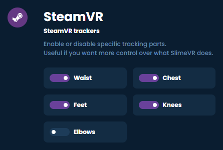

# 配置您的追踪器

## 配置所需虚拟追踪器的数量

在启动 SteamVR 之前，请勾选与您希望生成的 SteamVR 虚拟追踪器数量相对应的复选框。

请注意，这仅影响 Steam 中的虚拟追踪器，而不影响您的 SlimeVR 追踪器。如果您只启用了腰部和脚部，它们仍然可以访问最多 8 个 IMU 的配置（腰部、胸部、大腿、小腿和脚部）。目前，VRChat 支持 11 个虚拟追踪器，包括头显和控制器。

### 根据您的配置启用的 SteamVR 追踪器

- 5+0：腰部和脚部。
- 5+1：*胸部*、腰部和脚部。
- 5+3：*胸部*、腰部、*膝盖*、脚部。
- 7+3：*胸部*、腰部、*膝盖*、脚部、*肘部*

*斜体标记的追踪器仅在您的游戏或应用程序支持时才应启用（VRChat 支持）。*

需要注意的是，SlimeVR 的小腿和脚部追踪器会合并为一个 SteamVR 追踪器。同样，臀部和腰部追踪器也会合并为一个 SteamVR 追踪器。

不要启用您不需要的追踪器，否则可能导致游戏内校准问题。

准备就绪后启动 SteamVR。

### 在 VR 中访问 SlimeVR Server

有几种方法可以在 VR 中查看和与 SlimeVR GUI 交互。包括使用 Steam 仪表板（免费）、[Desktop+](https://store.steampowered.com/app/1494460/Desktop/)（免费）、[OVR Toolkit](https://store.steampowered.com/app/1068820/OVR_Toolkit/)（付费）或 [XSOverlay](https://store.steampowered.com/app/1173510/XSOverlay/)（付费）。

### 重置追踪器

进入 VR 后，您的追踪器会四处漂浮，不会跟随您的身体。要解决此问题，您需要执行追踪器重置。

执行追踪器重置：

1. 站直，双腿垂直（不要并拢），追踪器朝向指定方向。
2. 按下 SlimeVR Server 中的 **重置** 按钮。
3. 向前看，保持姿势直到倒计时结束。
4. 计时器结束后，您应该看到追踪器指向正确的方向并在您身体下方。

低头看。重置后，追踪器应直接在您身体下方并跟随您的动作；但由于您尚未配置身体比例，它们可能无法相对于您真实身体精确定位。

请参阅[设置重置快捷键](setting-reset-bindings.md)以了解如何在 VR 中快速轻松地重置追踪器。

*由 eiren 创建，由 adigyran、calliepepper、smeltie、erimel、emojikage 和 nwbx01 编辑，由 calliepepper 设计样式。*
