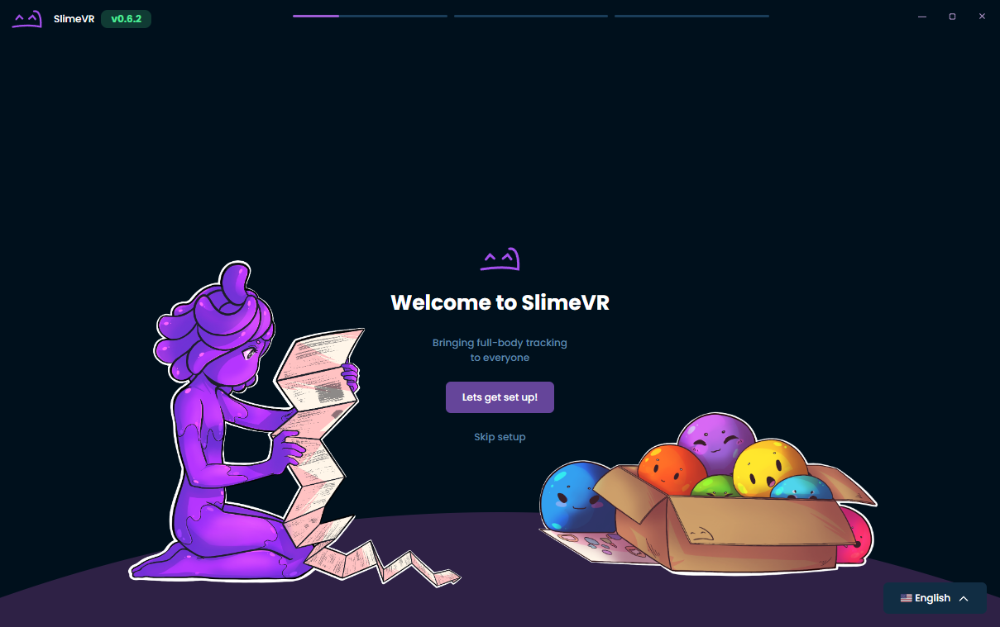
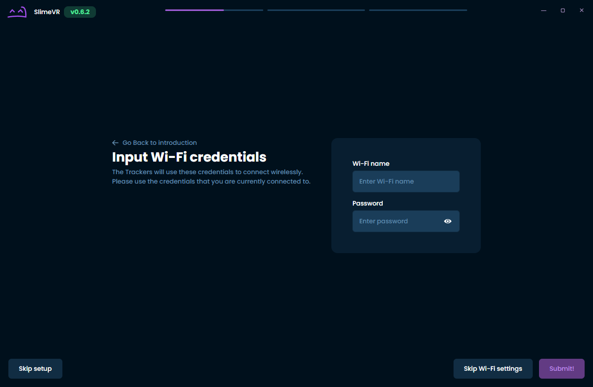
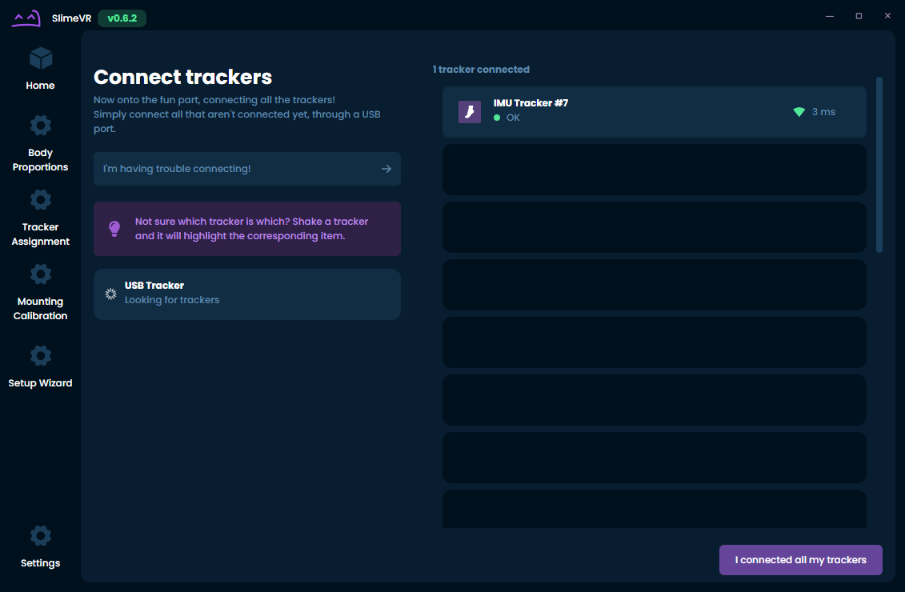
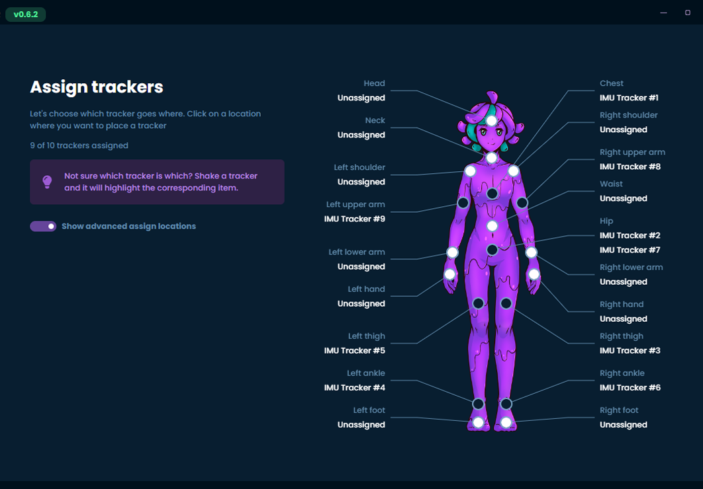
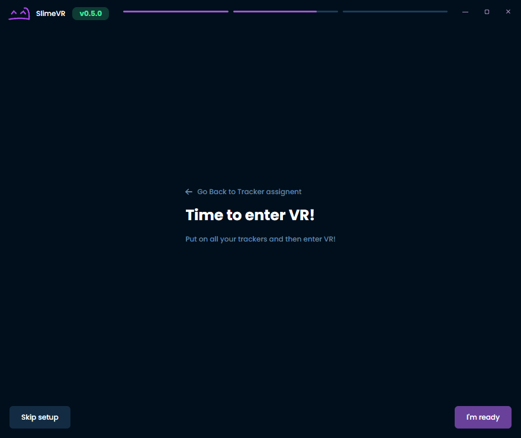
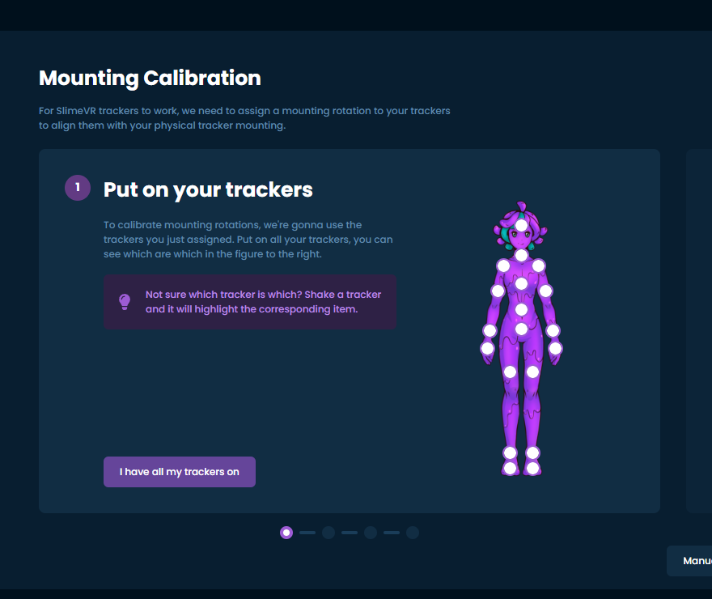
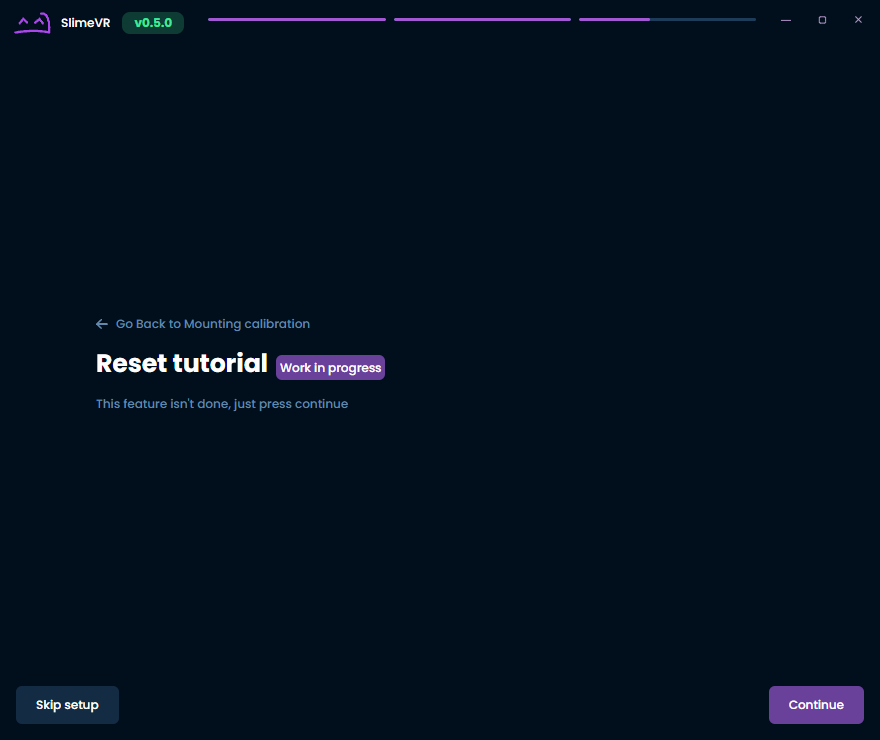
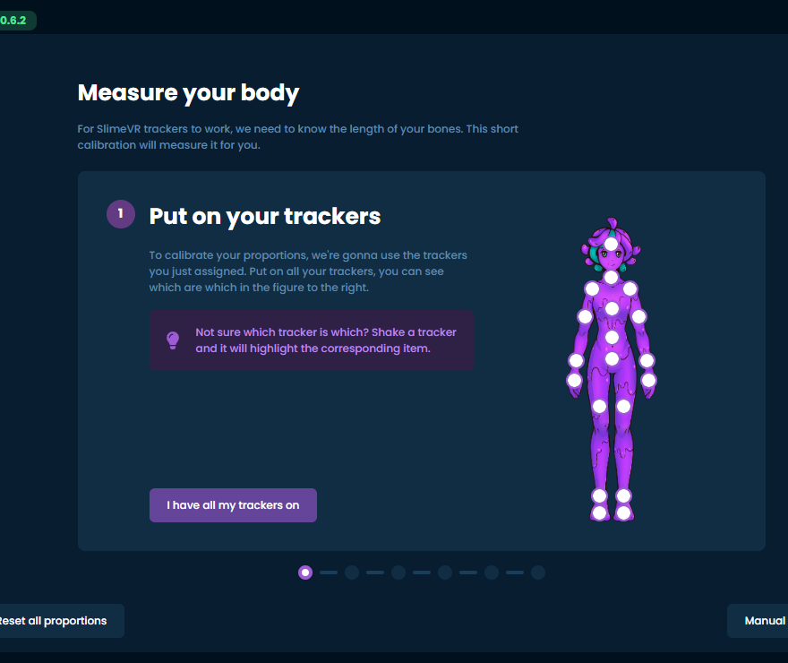

# 连接您的追踪器

本指南将帮助您设置 SlimeVR 追踪器和软件。

## 连接追踪器

> **注意：** 如果您使用的是硬编码了 Wi-Fi 凭据的自制追踪器或使用 owoTrack 的手机，您可以跳转到分配追踪器的步骤。但是，如果您硬编码了 Wi-Fi 凭据但遇到连接问题，以下步骤仍可能有助于诊断问题。

1. 打开 SlimeVR Server，点击 **设置向导**，请注意如果需要，您可以在此时右下角更改显示语言。

   

1. 输入您的 Wi-Fi 凭据，以便您的追踪器能够连接到 Wi-Fi，然后点击 **提交**。
> **注意** 如果您使用的是官方追踪器，请确保在此过程中打开它们！

   

1. 一次插入一个追踪器。稍等片刻后，您应该会看到追踪器出现。完成后点击 **我已连接所有追踪器**。

   

1. 悬停并点击您想要使用的未分配追踪点。摇晃追踪器会将其高亮显示。完成后点击 **我已分配所有追踪器**。

   

1. 恭喜！您已连接所有追踪器，但还有更多步骤需要完成。戴上追踪器后，点击 **我已准备就绪**。

   

1. 下一步是确保您的追踪器能够朝正确的方向移动。只需按照指示操作，在安装方向校准完成后点击 **下一步**。有关安装的更多信息，请参见[佩戴追踪器页面](putting-on-trackers.md)。

   

1. 目前重置教程尚未就绪，但您可以在此期间查看[重置绑定页面](setting-reset-bindings.md)以获取更多信息。只需点击 **继续**。

   

1. 最后一步您需要进入 VR。这包括双脚固定在地面上扭动身体，以便确定您的身体比例。只需按照屏幕上的指示操作。请务必验证结果，确保没有明显错误，例如颈长为 100 厘米！完成后点击 **继续**。

   

1. 大功告成！如果您已完成以上所有步骤，您应该已经准备好开始使用 SlimeVR 了！

   

### 故障排除

如果所有追踪器都没有显示，可能是 Windows 防火墙阻止了连接。要解决此问题，请转到 SlimeVR Server 文件夹并以管理员身份运行 `firewall.bat`。如果这不起作用，可以在[常见问题页面](../common-issues.md#the-trackers-are-connected-to-my-wifi-but-dont-turn-up-on-slimevr)上找到更多步骤。

有关追踪器的更多信息，您可能需要启用 **开发者模式**。该设置可在 **设置**、**通用**、然后 **界面** 下找到。

如果某些追踪器没有显示，请尝试关闭然后重新打开它们。您可以旋转追踪器并在服务器中查看其旋转变化，以确定哪个追踪器是哪个。

如果某些追踪器在移动时旋转数据没有变化（包括扩展模块），或显示 0 0 0 旋转，请尝试关闭然后重新打开它们，通常这可以解决问题。

如果任何追踪器显示 ERROR 状态，或橙色和蓝色灯持续亮起，这表示存在问题。请尝试重新启动它们，看看是否有所改善。如果不行，请联系 Eiren。

*由 eiren 创建，由 adigyran、calliepepper、emojikage 和 nwbx01 编辑，由 calliepepper 设计样式。*
