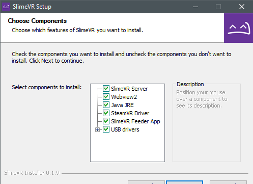
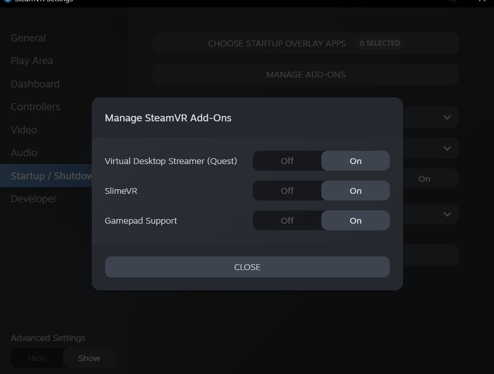
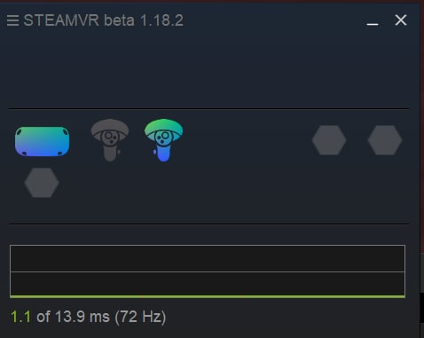
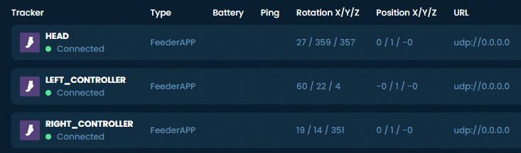

# 初始设置

本指南将帮助您安装 SlimeVR Server 并进行初始配置，确保一切正常运行。

## 安装最新的 SlimeVR 安装程序

最新的 [SlimeVR 安装程序可在此处找到](https://slimevr.dev/download)。下载并安装它，此安装程序将来也可用于更新服务器软件。

请注意，如果您计划仅通过 OSC 进行[独立使用](osc-information.md)，而不通过 SteamVR 进行 PC VR 使用，您可以取消选择 **SteamVR Driver**、**SlimeVR Feeder App** 和 **USB drivers**。如果您尚未安装并启动过 SteamVR，可能会遇到错误。

## 测试您的追踪器

打开每个追踪器，检查它们是否工作。

每个追踪器在启动时应短暂闪烁 LED 灯，然后每隔几秒闪烁一次以指示其状态，如下所示：

| 闪烁次数 | 状态 |
| :------: | :--: |
| 1 | 追踪器已就绪 |
| 2 | 正在连接 SlimeVR 服务器 |
| 3 | 正在连接 Wi-Fi |
| 5 | IMU 错误 |

如果追踪器无法启动，请尝试为其充电。通过 USB 端口将追踪器连接到您的 PC 或任何 USB 充电器。红色 LED 灯亮起表示正在充电。绿色或蓝色 LED 灯表示已充满（LED 颜色可能因充电板不同而异）。尝试在充电时打开追踪器，检查是否能正常工作。

**请注意，通常情况下，自制的追踪器在充电时应保持关闭状态，除非在此特定情况下。**

## IMU 校准

根据您使用的 IMU 型号，您需要以不同方式对其进行校准。要了解如何校准您的 IMU，请前往 [IMU 校准页面](imu-calibration.md)。

## 检查驱动程序加载和连接

1. 启动 SteamVR，进入 **设置** > **管理加载项**。检查 SlimeVR 是否在此处存在，将其设置为 **开启**。

   
1. 通过开始菜单中的 "SlimeVR Server" 快捷方式启动 SlimeVR Server。
1. 重新启动 SteamVR。现在您应该能在 SteamVR 中看到 3 个激活的追踪器：

   
1. 在 SlimeVR Server 中，您应该会看到随着头显和控制器的移动，其旋转数据发生变化：

   

*由 Eiren 创建，由 adigyran、calliepepper、emojikage 和 nwbx01 编辑，由 calliepepper 设计样式。*
