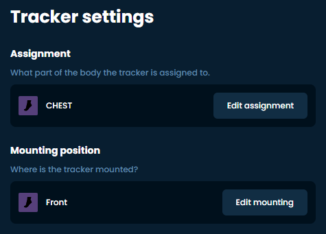

# 佩戴您的追踪器

根据您预设的位置佩戴追踪器。您可以选择任何舒适的佩戴位置，但需要遵守一些规则：

1. 您应根据佩戴追踪器的身体部位设置相应的追踪器角色。这包括追踪器扩展模块。请参考图片了解角色名称及其推荐的安装点。
2. 您应根据安装方向设置追踪器方向。安装时，请确保它们佩戴牢固，并且在您站直时尽可能朝向该方向。也就是说，"向前" 应与您向前看时 HMD 朝向的方向一致！或者，您可以尝试自动安装校准。
3. 您可以将追踪器倾斜向前/向后或侧面安装，这不会影响追踪效果。
4. 您可以将追踪器安装在指定身体部位上任何感觉舒适的位置，但区域受肌肉运动影响越小，追踪效果越好。确保当您弯曲关节时追踪器随之移动以记录运动。**特别注意腰部追踪器，有许多安装位置可能无法记录您弯腰的动作。请将其安装在臀部上方、肚脐附近的高度。**

## 推荐的追踪器放置方案

- 5 个追踪器：胸部、大腿和小腿。
- 6 个追踪器：胸部、髋部、大腿和小腿。
- 7 个追踪器：胸部、腰部、髋部、大腿和小腿。
- 8 个追踪器：胸部、髋部、大腿、小腿和脚部。
- 9 个追踪器：胸部、腰部、髋部、大腿、小腿和脚部。
- 10 个追踪器：胸部、髋部、大腿、小腿、脚部和上臂。
- 11 个追踪器：胸部、腰部、髋部、大腿、小腿、脚部和上臂。
- 12 个追踪器：上胸部、胸部、腰部、髋部、大腿、小腿、脚部和上臂。
- 14 个追踪器：上胸部、胸部、腰部、髋部、大腿、小腿、脚部、上臂和肩部或前臂（用于 VRChat 仅肩部追踪）。

## 推荐的安装点

- 上胸部：朝前，位于胸部上方。
- 胸部：朝前，位于胸部中部或下部。
- 腰部：根据您的体型朝前或朝侧面安装在腰部（臀部上方、肚脐附近的高度）。
- 髋部：朝前或朝后安装在髋部（系腰带的位置）。
- 大腿：根据您的体型安装于膝盖正上方或大腿较高位置。
- 小腿：安装在脚踝处，朝向任意方向。
- 脚部：安装在脚背。追踪器的"上方"朝向脚踝，"前方"朝向天花板。
- 上臂：安装在上臂（肘部上方），侧面或背面（前方为肱二头肌方向）。
- 肩部：安装在肩部上方。
- 前臂：安装在前臂（肘部下方），内侧，靠近肘部。

还建议将追踪器直接安装在裸露皮肤上以获得更好的粘附性（更稳定，更少滑动）。

### 备选安装点

最佳的安装位置因人而异，因为体型差异很大。请随意尝试，一次更改一个追踪器以观察效果。

<iframe width="100%" height="auto" src="https://www.youtube.com/embed/MMJ8843zqNM" title="YouTube video player" frameborder="0" allow="accelerometer; autoplay muted; clipboard-write; encrypted-media; gyroscope; picture-in-picture" allowfullscreen></iframe>

 

<iframe width="100%" height="auto" src="https://www.youtube.com/embed/aM0jXEYQAeY" title="YouTube video player" frameborder="0" allow="accelerometer; autoplay muted; clipboard-write; encrypted-media; gyroscope; picture-in-picture" allowfullscreen></iframe>

*由 eiren 创建，由 adigyran、calliepepper、spazzwan、erimel、emojikage 和 nwbx01 编辑，由 calliepepper 设计样式。视频由 zrock35 制作。*
