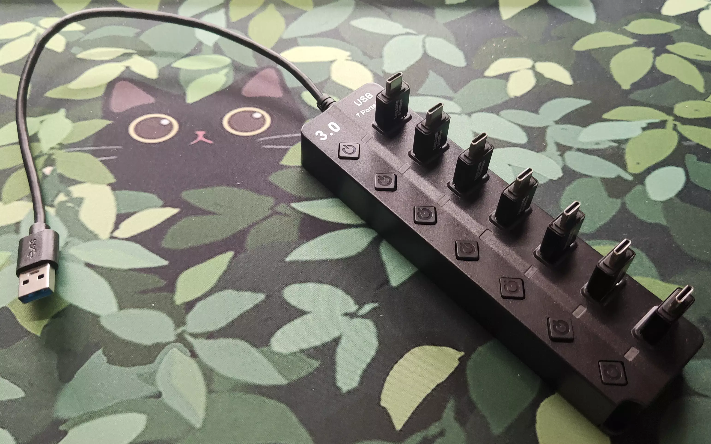

<link rel="stylesheet" href="../assets/css/smol-slimes.css">

# Smol 社区底座

欢迎来到 Smol 社区底座页面！
在这里您将找到 SlimeVR 社区贡献的 DIY 底座方案合集。

## 目录

- TOC
{:toc}

## 社区底座制作

### Depact Smol Sudo 底座

一个使用 USB 集线器和 OTG 连接器的极其简约的底座设置。

#### 部件

| 部件描述 | 链接 | 备注 |
| --------------------------------------- | --------------------------------------------------------------- | ------------------------------------------------- |
| 7 端口 USB 3.0 集线器 | [AliExpress](https://aliexpress.com/item/1005008981599421.html) | 任何具有足够端口的 USB 3.0 集线器都可以 |
| Type-C 公头转 USB-A 公头 OTG 转接头 | [AliExpress](https://aliexpress.com/item/1005007396270447.html) | 可以用短的 USB-A 转 USB-C 线缆代替 |

#### 组装

组装就像将 OTG 转接头插入集线器一样简单。

#### 优缺点

**优点：**

- 极其实惠且非常容易组装
- 灵活，部件易得
- 允许在不拆除绑带的情况下存放追踪器

**缺点：**

- OTG 转接头可能会松动或脱落
- 整体结构可能感觉不牢固

---

## 贡献

想要分享您自己的 DIY 底座设计、技巧或资源？
我们欢迎社区贡献！

- **如何贡献：**
- 在 [SlimeVR Discord](https://discord.gg/slimevr) 中提出更改建议并分享您的想法
- 或者在 [SlimeVR Docs GitHub 仓库](https://github.com/SlimeVR/SlimeVR-Docs-Site) 上提交 Pull Request

贡献时，请附上清晰的照片、描述以及任何相关的链接或文件。
您的贡献将帮助使 VR 更易于访问，并让每个人都能更轻松地进行构建！

*由 Shine Bright ✨ 和 [Depact](https://github.com/Depact) 创建*
