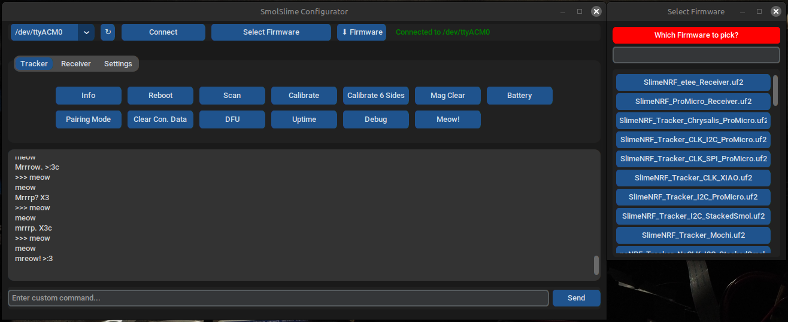
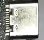
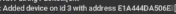

# SmolSlimeConfigurator
适用于 SlimeVR Smol Slimes 的纯简单 UI 配置器（非官方）
Github 页面：[SmolSlimeConfigurator](https://github.com/ICantMakeThings/SmolSlimeConfigurator/tree/main)



# 功能

- **易于使用的界面** — 简洁、现代、易于使用，带有有用的工具提示。
- **轻松配置** — 一键按钮用于校准、配对等。
- **自动固件更新器** — 通过 USB 插入追踪器，选择固件类型，立即刷写最新版本。
- **始终保持最新** — 固件列表自动从 GitHub 获取最新的每日构建。
- **自定义固件支持** — 轻松刷写您自己的 `.uf2` 或 `.hex` 文件（现在支持所有接收器和追踪器）。
- **收藏夹系统** — 通过右键单击（macOS 上为中键单击）为您最常用的固件版本添加星标。
- **跨平台** — 适用于 **Windows**、**Linux**、**macOS** 和 **Android**。
- **主题定制** — 在**亮色/暗色模式**之间切换，并选择您喜欢的强调色。


# 下载
有两种运行配置器的方式：
- 单文件可执行文件可从 [Releases](https://github.com/ICantMakeThings/SmolSlimeConfigurator/releases) 获取（Windows、Linux、macOS、Android）。
- 上述上传文件中的 Python 文件。
- 要从源代码构建，请运行：
```bash
pyinstaller --onefile --windowed --icon=icon.png --add-data "icon.png:." --add-binary "/Location/To/UR/NameOfVenv/bin/nrfutil:." SmolSlimeConfiguratorV8.py
```
*注意：您**必须**使用虚拟环境，**必须**使用 Python 3.10.x，并在 macOS 上将图标文件扩展名更改为 `.icns`，在 Windows 上更改为 `.ico`。*


# 说明
**注意：** 有一个[视频教程](https://youtu.be/2PHelwy7Rcs)解释了一般用法，[此视频](https://www.youtube.com/watch?v=ENINHh4L8tk)详细介绍了 **Android 使用**。

### **首次安装**

+ 插入追踪器或接收器，然后按两次复位。在没有复位按钮的板上，将一根 wire 的一端放在 RST 引脚上 
并双击一个 GND 引脚（Nice!Nano/ProMicro 上的 USB-C 连接器）
+ 按 "↻" 刷新，然后从刷新按钮左侧的下拉菜单中选择端口，然后按 "Connect"
+ 从名为 "Select Firmware" 的下拉菜单中选择硬件版本，按 "⬇ Firmware"，等待约 20 秒，追踪器将刷写。

### **配对**

+ 插入您的接收器，按 "↻" 刷新，选择端口，然后按 "Connect"。
+ 要配置您的接收器，选择接收器选项卡，按下配对模式，然后逐个开启每个追踪器的电源。您应该注意到  追踪器正在被添加。所有追踪器都配对后，按 "Exit Pairing Mode"。

### **校准**

+ 插入追踪器，按 "↻" 刷新，选择 COM 端口，然后按 "Connect"。按 "Calibrate 6 Sides" 并按照终端说明操作。
+ 然后按 "Calibrate"，将追踪器放在桌子上约 5 秒，就完成了！
**注意：** 您也可以双击追踪器的按钮来代替按 "Calibrate"。

### **更新固件**

+ 连接到端口，选择固件，按 "⬇ Firmware" 并等待约 20 秒。

**注意：** 追踪器和接收器必须全部更新到相同版本，否则它们将无法配对。
