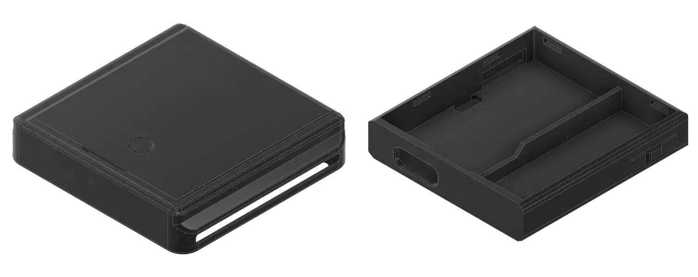
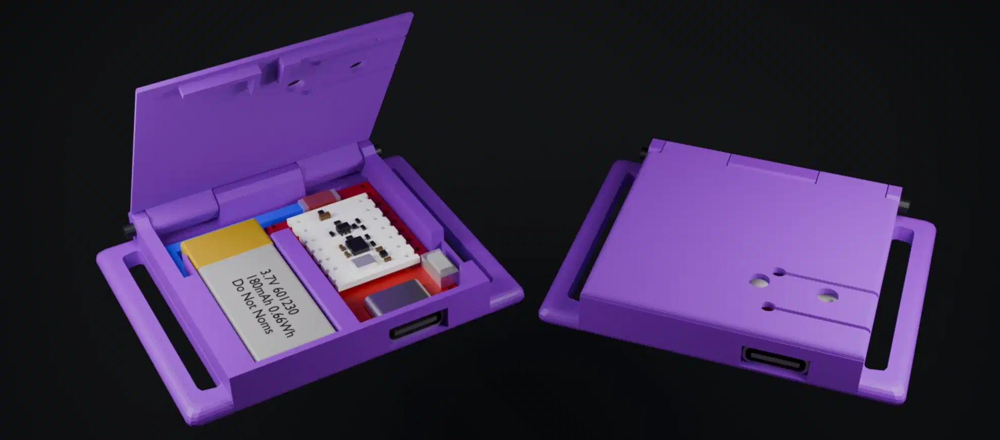
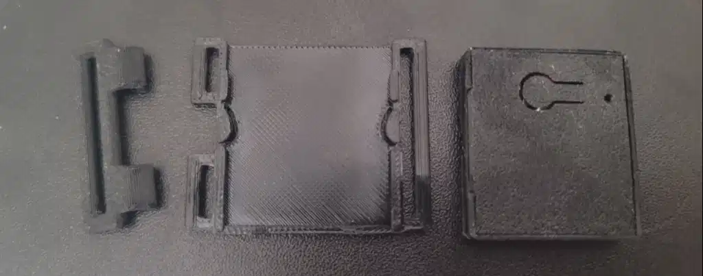
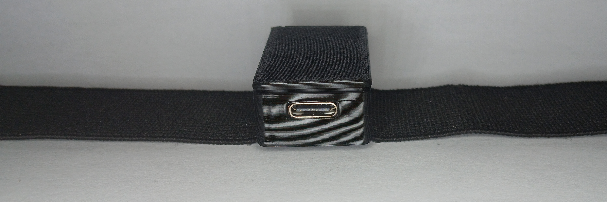
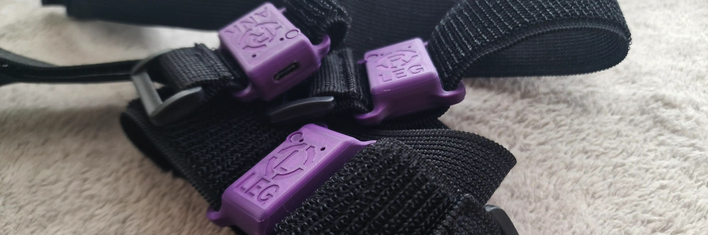
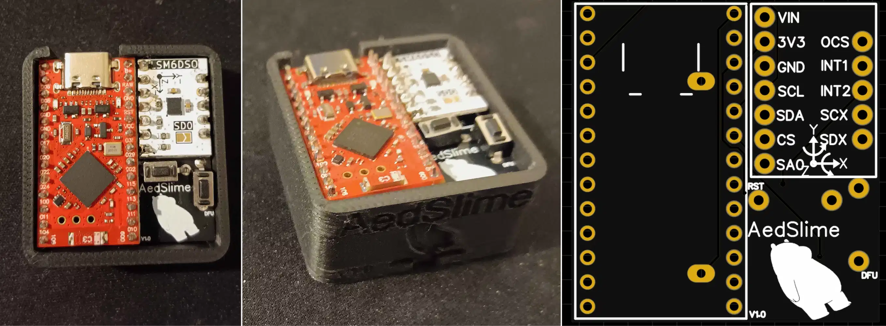
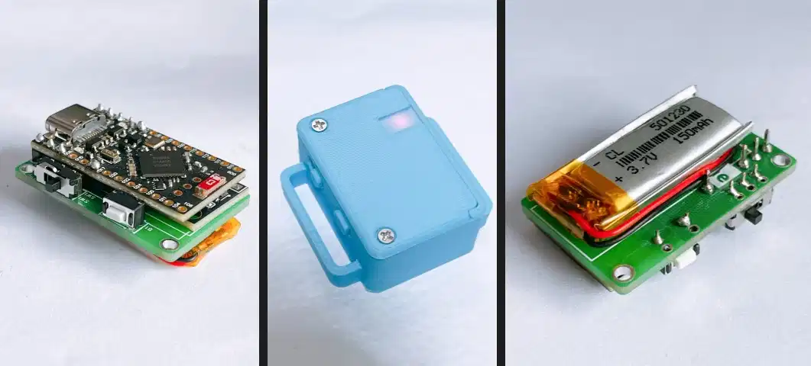
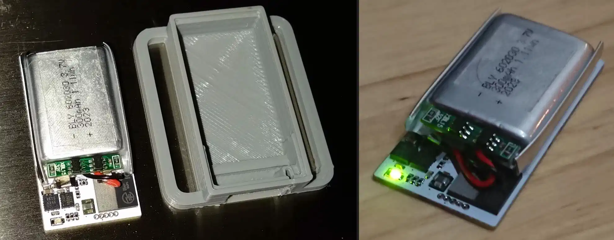
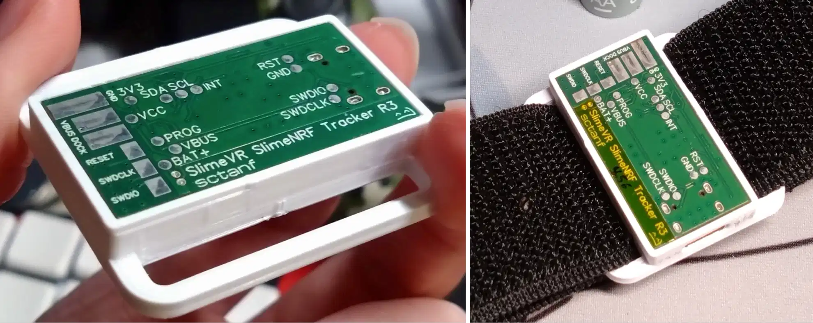
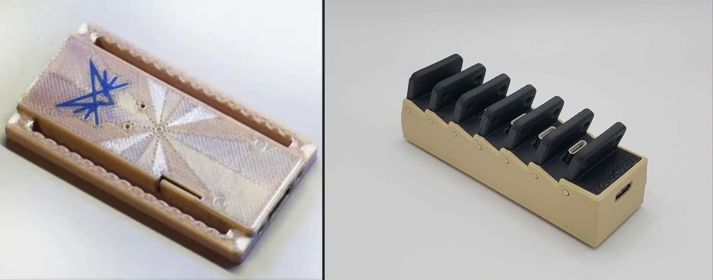

<link rel="stylesheet" href="../assets/css/smol-slimes.css">

# Smol 社区构建

本页面致力于展示任何人都可以复现的构建。

未开源或缺乏足够文档以被复制的构建不会在此列出。

## 目录

- TOC
{:toc}

## 堆叠式社区构建

在堆叠式设计中，IMU 放置在板卡上方。如果电池也合适，这样可以方便更换外壳。

  <table class="transform-table-to-list-on-mobile table-sort table-arrows">
    <thead>
      <tr>
        <th class="disable-sort">图片</th>
        <th class="onload-sort">名称</th>
        <th>作者</th>
        <th>链接</th>
        <th>USB</th>
        <th>电池</th>
        <th>绑带宽度</th>
        <th>底座</th>
        <th>接收器</th>
      </tr>
    </thead>
    <tbody>
      <tr>
        <td class="case-image" data-label="图片">
          
        </td>
        <td class="case-name" data-label="名称">Gremlin</td>
        <td class="case-author" data-label="作者">ManicQuinn</td>
        <td class="case-link" data-label="链接">
          <a href="https://github.com/ManicQuinn/SlimeVR-Gremlin">GitHub</a>
        </td>
        <td class="case-usb" data-label="USB">✅</td>
        <td class="case-battery" data-label="电池">
          

            110 mAh
            401230 电池
          

        </td>
        <td class="case-strap-width" data-label="绑带宽度">30 mm</td>
        <td class="case-dock" data-label="底座">✖️</td>
        <td class="case-dongle" data-label="接收器">✖️</td>
      </tr>
      <tr>
        <td class="case-image" data-label="图片">
          
        </td>
        <td class="case-name" data-label="名称">Smol Panini 外壳</td>
        <td class="case-author" data-label="作者">TigsterCox</td>
        <td class="case-link" data-label="链接">
          <a href="https://github.com/TigsterCox/Smol-Panini-Case/">Github</a>
        </td>
        <td class="case-usb" data-label="USB">✅</td>
        <td class="case-battery" data-label="电池">
          

            180 mAh
            601230 电池
          

        </td>
        <td class="case-strap-width" data-label="绑带宽度">30 mm</td>
        <td class="case-dock" data-label="底座">✖️</td>
        <td class="case-dongle" data-label="接收器">✖️</td>
      </tr>
      <tr>
        <td class="case-image" data-label="图片">
          
        </td>
        <td class="case-name" data-label="名称">Ibis 追踪器</td>
        <td class="case-author" data-label="作者">brisfknibis</td>
        <td class="case-link" data-label="链接">
          <a href="https://github.com/brisfknibis/ibis-trackers/">Github - 堆叠式</a>
        </td>
        <td class="case-usb" data-label="USB">✅</td>
        <td class="case-battery" data-label="电池">
          

            120 mAh
            401230 电池
          

        </td>
        <td class="case-strap-width" data-label="绑带宽度">30 mm</td>
        <td class="case-dock" data-label="底座">✅</td>
        <td class="case-dongle" data-label="接收器">✖️</td>
      </tr>
      <tr id="LyallUlric-Stacked-SmolSlime-build">
        <td class="case-image" data-label="图片">
          
        </td>
        <td class="case-name" data-label="名称">堆叠式 SmolSlime</td>
        <td class="case-author" data-label="作者">LyallUlric</td>
        <td class="case-link" data-label="链接">
          <a href="https://www.thingiverse.com/thing:6941615">Thingiverse</a>
        </td>
        <td class="case-usb" data-label="USB">✅</td>
        <td class="case-battery" data-label="电池">
          

            100 mAh
            401030 电池
          

        </td>
        <td class="case-strap-width" data-label="绑带宽度">30 mm</td>
        <td class="case-dock" data-label="底座">✖️</td>
        <td class="case-dongle" data-label="接收器">✅</td>
      </tr>
      <tr>
        <td class="case-image" data-label="图片">
          
        </td>
        <td class="case-name" data-label="名称">SmolSlimeSMOL</td>
        <td class="case-author" data-label="作者">ICantMakeThings</td>
        <td class="case-link" data-label="链接">
          <a href="https://thingiverse.com/thing:7062978">Thingiverse</a>
        </td>
        <td class="case-usb" data-label="USB">✅</td>
        <td class="case-battery" data-label="电池">
          

            500 mAh
            402035 电池
          

        </td>
        <td class="case-strap-width" data-label="绑带宽度">25mm</td>
        <td class="case-dock" data-label="底座">✖️</td>
        <td class="case-dongle" data-label="接收器">✖️</td>
      </tr>
      <tr>
        <td class="case-image" data-label="图片">
          
        </td>
        <td class="case-name" data-label="名称">Miro 追踪器</td>
        <td class="case-author" data-label="作者">spiro.ooo</td>
        <td class="case-link" data-label="链接">
          <a href="https://github.com/spironoo/miro-cases">Github</a>
        </td>
        <td class="case-usb" data-label="USB">✅</td>
        <td class="case-battery" data-label="电池">
          

            120 mAh
            401230 电池
          

        </td>
        <td class="case-strap-width" data-label="绑带宽度">25mm/38mm</td>
        <td class="case-dock" data-label="底座">✖️</td>
        <td class="case-dongle" data-label="接收器">✖️</td>
      </tr>
    </tbody>
  </table>

## 非堆叠式社区构建

!!! note
    Ibis Chrysalis 列为非堆叠式，因为它需要 "Chrysalis" 扩展板。这使得它与其他堆叠式外壳不兼容，并且其外壳与不使用此扩展板的堆叠式设计也不兼容。

  <table class="transform-table-to-list-on-mobile table-sort table-arrows">
    <thead>
      <tr>
        <th class="disable-sort">图片</th>
        <th class="onload-sort">名称</th>
        <th>作者</th>
        <th>链接</th>
        <th>USB</th>
        <th>电池</th>
        <th>绑带宽度</th>
        <th>底座</th>
        <th>接收器</th>
      </tr>
    </thead>
    <tbody>
      <tr>
        <td class="case-image" data-label="图片">
          
        </td>
        <td class="case-name" data-label="名称">Aed-Slimes</td>
        <td class="case-author" data-label="作者">Aed</td>
        <td class="case-link" data-label="链接">
          <a href="https://github.com/Aed-1/Aed-Slimes">GitHub</a>
        </td>
        <td class="case-usb" data-label="USB">✅</td>
        <td class="case-battery" data-label="电池">
          

            120 mAh
            LIR2450 电池
          

        </td>
        <td class="case-strap-width" data-label="绑带宽度">35 mm</td>
        <td class="case-dock" data-label="底座">✖️</td>
        <td class="case-dongle" data-label="接收器">✖️</td>
      </tr>
      <tr>
        <td class="case-image" data-label="图片">
          
        </td>
        <td class="case-name" data-label="名称">Marzipan</td>
        <td class="case-author" data-label="作者">Colanns</td>
        <td class="case-link" data-label="链接">
          <a href="https://github.com/colasama/Marzipan">GitHub</a>
        </td>
        <td class="case-usb" data-label="USB">✅</td>
        <td class="case-battery" data-label="电池">
          

            110 mAh
            401230 电池
          

          /
          

            170 mAh
            501230 电池
          

        </td>
        <td class="case-strap-width" data-label="绑带宽度">25 mm</td>
        <td class="case-dock" data-label="底座">✖️</td>
        <td class="case-dongle" data-label="接收器">✖️</td>
      </tr>
      <tr>
        <td class="case-image" data-label="图片">
          
        </td>
        <td class="case-name" data-label="名称">Ibis 追踪器</td>
        <td class="case-author" data-label="作者">brisfknibis</td>
        <td class="case-link" data-label="链接">
          <a href="https://github.com/brisfknibis/Chrysalis-Trackers/">Github - Chrysalis</a>
        </td>
        <td class="case-usb" data-label="USB">✅</td>
        <td class="case-battery" data-label="电池">
          

            120 mAh
            401230 电池
          

        </td>
        <td class="case-strap-width" data-label="绑带宽度">30 mm</td>
        <td class="case-dock" data-label="底座">✅</td>
        <td class="case-dongle" data-label="接收器">✖️</td>
      </tr>
    </tbody>
  </table>

## 🚫 不推荐用于新追踪器构建

  <table class="transform-table-to-list-on-mobile table-sort table-arrows">
    <thead>
      <tr>
        <th class="disable-sort">图片</th>
        <th class="onload-sort">名称</th>
        <th>不推荐原因</th>
        <th>作者</th>
        <th>链接</th>
        <th>USB</th>
        <th>电池</th>
        <th>绑带宽度</th>
        <th>底座</th>
        <th>接收器</th>
      </tr>
    </thead>
    <tbody>
      <tr>
        <td class="case-image" data-label="图片">
          
        </td>
        <td class="case-name" data-label="名称">SlimeNRF R1/R2</td>
        <td class="case-not-recommended-reason" data-label="不推荐原因">仅支持 I2C 设计</td>
        <td class="case-author" data-label="作者">sctanf</td>
        <td class="case-link" data-label="链接">
          <a href="https://github.com/SlimeVR/SlimeVR-Tracker-nRF-PCB">GitHub</a>
        </td>
        <td class="case-usb" data-label="USB">✖️</td>
        <td class="case-battery" data-label="电池">
          

            300 mAh
            601230 电池
          

        </td>
        <td class="case-strap-width" data-label="绑带宽度">35 mm</td>
        <td class="case-dock" data-label="底座">✅</td>
        <td class="case-dongle" data-label="接收器">✖️</td>
      </tr>
      <tr>
        <td class="case-image" data-label="图片">
          
        </td>
        <td class="case-name" data-label="名称">SlimeNRF R3</td>
        <td class="case-not-recommended-reason" data-label="不推荐原因">仅支持 I2C 设计</td>
        <td class="case-author" data-label="作者">sctanf</td>
        <td class="case-link" data-label="链接">
          <a href="https://oshwlab.com/sctanf/slimenrf3">Oshwlab</a>
        </td>
        <td class="case-usb" data-label="USB">✅</td>
        <td class="case-battery" data-label="电池">
          

            80 mAh
            301230 电池
          

          /
          

            100 mAh
            242030 电池
          

        </td>
        <td class="case-strap-width" data-label="绑带宽度">35 mm</td>
        <td class="case-dock" data-label="底座">
          

            ✅
            使用 SlimeNRF R1/R2 底座。
          

        </td>
        <td class="case-dongle" data-label="接收器">✖️</td>
      </tr>
      <tr>
        <td class="case-image" data-label="图片">
          
        </td>
        <td class="case-name" data-label="名称">SlimeNRF-Fuimini</td>
        <td class="case-not-recommended-reason" data-label="不推荐原因">仅支持 I2C 设计</td>
        <td class="case-author" data-label="作者">Zipra1</td>
        <td class="case-link" data-label="链接">
          <a href="https://github.com/Zipra1/SlimeNRF-Fuimini">GitHub</a>
        </td>
        <td class="case-usb" data-label="USB">✅</td>
        <td class="case-battery" data-label="电池">100 mAh</td>
        <td class="case-strap-width" data-label="绑带宽度">50 mm</td>
        <td class="case-dock" data-label="底座">✅</td>
        <td class="case-dongle" data-label="接收器">
          

            ✅
            为 eByte E104-BT5040U 接收器定制的外壳。
          

        </td>
      </tr>
    </tbody>
  </table>

## 贡献

**想要贡献您的设计？** 太棒了！要让您的构建被添加到这个列表中，请确保满足以下条件：

- 您的制作方案必须**公开可访问**（例如 GitHub（首选）、Thingiverse 等）。
- 至少包含一张清晰的构建图片或渲染图，建议使用 2:1 或 3:1 的宽高比。
- 提供基本的构建信息：
  - 是否有 USB 端口？
  - 使用什么电池尺寸/类型？
  - 是否兼容底座？/ 是否包含底座？
- 通过提交 Pull Request 来提交您的制作方案。

_由 Shine Bright ✨ 和 [Depact](https://github.com/Depact) 创建_

<!-- Table sorting library table-sort-js - https://www.jsdelivr.com/package/npm/table-sort-js -->

