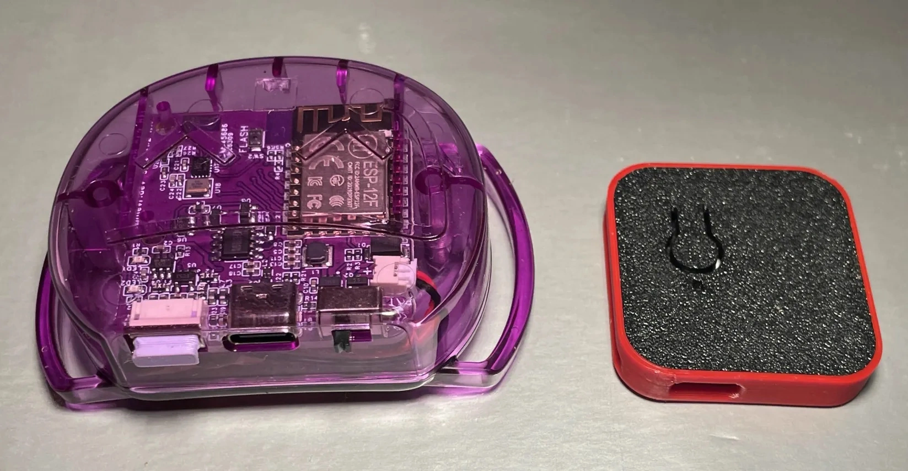
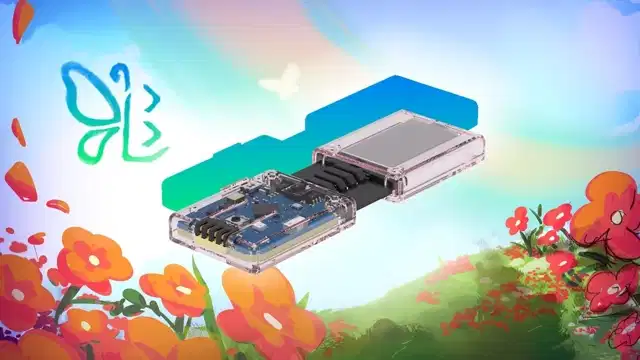

<link rel="stylesheet" href="../assets/css/smol-slimes.css">
<link rel="stylesheet" href="../assets/css/smol-slimes.css">

!!! warning
    **免责声明：** 此项目高度实验性。这些设备可能与旧版本的 SlimeVR Server 不兼容，并可能需要频繁的固件更新。在此阶段，包括硬件、固件和通信协议在内的一切都尚未最终确定。

# Smol（nRF 方案）与普通 ESP（WiFi 方案）SlimeVR 追踪器对比
目前，官方 SlimeVR 追踪器和大多数 DIY 追踪器通过 2.4 GHz WiFi 网络连接到 SlimeVR Server。Smol 追踪器则改变了这一方式，通过插入用户电脑/头戴设备/手机的接收器进行无线通信，消除了对可用 WiFi 网络的需求。

## 快速对比

  <table class="transform-table-to-list-on-mobile">
    <thead>
      <tr>
        <th>追踪器类型</th>
        <th>通信方式</th>
        <th>平均重量</th>
        <th>电池续航</th>
        <th>范围</th>
        <th>总结</th>
      </tr>
    </thead>
    <tbody>
      <tr>
        <td>官方 WiFi 追踪器</td>
        <td data-label="通信方式：">2.4 GHz WiFi</td>
        <td data-label="平均重量：">50 g</td>
        <td data-label="电池续航：">18-20 小时</td>
        <td data-label="范围：">WiFi 覆盖范围</td>
        <td data-label="总结：">
          范围大得多。追踪器体积较大，电池续航较短。
          需要 WiFi 设置且依赖网络条件。
        </td>
      </tr>
      <tr>
        <td>Smol/Butterfly 追踪器</td>
        <td data-label="通信方式：">Enhanced ShockBurst (ESB)</td>
        <td data-label="平均重量：">~10-15 g</td>
        <td data-label="电池续航：">40-60 小时</td>
        <td data-label="范围：">距接收器 7-12 米（21-36 英尺）</td>
        <td data-label="总结：">
          范围较小。追踪器电池续航更长且体积更小。
          追踪器必须配对连接到主机设备的接收器。
        </td>
      </tr>
    </tbody>
  </table>

## 实际区别是什么？

### 1. 协议
典型的 WiFi 追踪器通过 WiFi 直接与 SlimeVR Server 通信。Smol 追踪器则使用 heavily modified 的 Enhanced ShockBurst (ESB) 协议（基于 nRF52 或 nRF54 微控制器），通过接收器与主机设备通信；从而降低延迟和功耗，但范围较小。

### 2. 尺寸与电池续航
当前官方追踪器使用 1350 mAh 电池，平均续航 12 到 18 小时。

推荐的 Smol 追踪器设计使用 401230 110 mAh 电池，目标最低续航 24 小时；但在推荐配置下通常可超过 40 小时。

Smol 追踪器还具有更小 PCB 的优势，平均重量根据设计不同在 10 到 15 克之间。官方追踪器更大更重，约 50 克。

#### 官方追踪器（左）与 Ibis 2.0 Smol 追踪器（右）
 
 
*图片由 Zrock35 提供。图中的 Ibis 2.0 追踪器大约 3 厘米乘 3 厘米，重 10 克。*

### 3. DIY 差异
*这在相应的 [WiFi 方案](../diy/index.md)和 [nRF 方案](hardware/index.md)追踪器 DIY 指南中有更详细的说明。*
- WiFi 追踪器目前需要载板 PCB、IMU 板和充电板，以及电池。
- 典型的堆叠式 Smol 套装由五个或更多追踪器连接到一个或多个接收器组成。
  - 基于 nRF52840 板的追踪器，每块板配有一个 IMU 和电池
  - 接收器（即接收器）用于将追踪器连接到服务器。这些通常也基于 nRF52840 或 nRF54L 板。
  - 更多信息请参阅[官方 Smol 文档](https://docs.slimevr.dev/smol-slimes/hardware/index.html)

### 4. 是否兼容独立模式？
是的，Smol 追踪器兼容独立版 VRChat。
如果运行 SlimeVR 的设备没有 USB-A 端口，则需要 OTG 适配器。

必须在 SlimeVR 中配置 Open Sound Control (OSC) 协议，以通过 WiFi 将追踪数据从服务器发送到独立版 VRChat。

## 我听说 Butterfly。那是什么？
### 🦋 Butterfly 追踪器介绍 – SlimeVR 官方 Smol 追踪器
想要比自行构建更简单的方案？Butterfly 追踪器将是 SlimeVR 官方推出的 Smol 追踪器——超薄、轻便，开箱即用。

🔗 在 <a href="https://www.crowdsupply.com/slimevr/slimevr-butterfly-trackers" target="_blank">CrowdSupply</a> 了解更多并查看活动。

*由 Shine Bright ✨、Amebun、[Depact](https://github.com/Depact) 和 [Seneral](https://github.com/Seneral) 创建*
