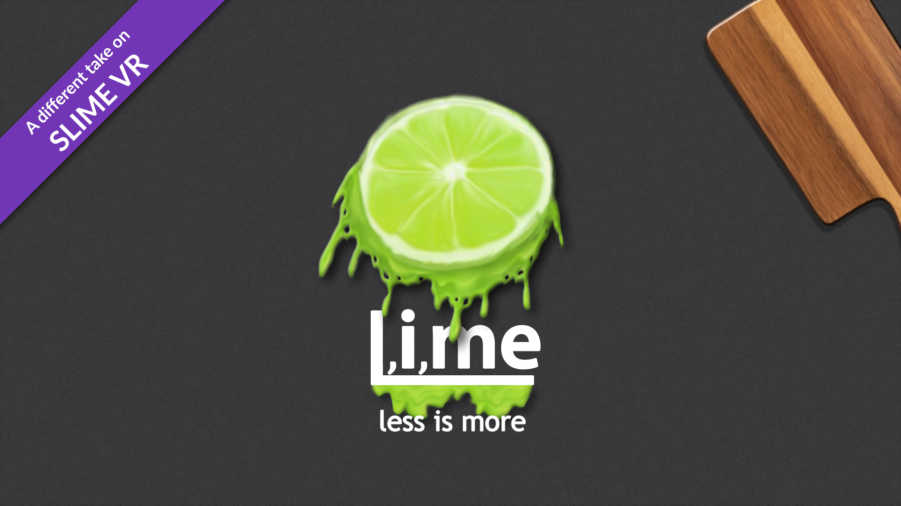

# L,i,me-Slimes {已过时}

## 当前 BETA 链接
https://discord.com/channels/817184208525983775/932241053375938562/1116357263758729256

原理图仍然相同

## 由 rosdayle 设计的 L,i,me
L,i,me 是标准 slime 的一种外壳和硬件变体，旨在原生支持完整的 **9** IMU 配置（目前正在进行一个可选附加组件的工作，以允许额外 4 个 IMU），同时尽可能精简，且性能不受任何影响。

## 适合谁？
- 适合那些希望通过轻松转换为 L,i,me 来精简当前标准 slime 设置的用户。
- 适合那些希望从一开始就制作一个完整的、不妥协的 9 IMU 配置的用户（并可选择额外增加 4 个 IMU 以实现肩部和肘部追踪）。
- 预算紧张但希望拥有高性能完整 9 IMU 配置的用户（并可在未来选择增加肩部和肘部追踪）。
- 那些打算将 SlimeVR 用于动作捕捉和 VTubing 的用户。

## 为什么选择 L,i,me？
- 与每个追踪器仅支持 **2 个 IMU** 的标准设置不同，每个 **L,i,me** 追踪器支持 **4 个 IMU**（无需任何软件修改）。因此，您只需要制作 3 个 L,i,me 追踪器，而不是制作 6 个标准 slime 追踪器来实现完整的 9 IMU 配置。
- 所需零件更少，使 L,i,me 成为成本最低的完整 9 IMU 配置（以及通过可选附加组件实现 11 或 13 IMU 配置）。
- 旨在通过减少总体体积（更少的主追踪器），提供舒适且完全可操作的最佳稳定追踪体验。
- 只需充电和维护 3 个追踪器（如果包括可选附加组件则为 4 个）。
- 模块化且可定制。
- ~~持续支持。~~ 如果您联系我，我可以提供任何缺少的模型，没有问题。然而，积极的开发现已结束。我将来会在 minted 名下重新整理并改进此设计。但这个版本仍然完全可用。您可以查看我的最新非变体版本 https://www.thingiverse.com/thing:5815469

## 用更少的资源做更多的事
- 更少的追踪器。
- 更少的零件。
- 更低的成本。
- 更少的制作。
- 更少的维护。
- 更少的充电设备。
- 更多 SLIME！

## Github 和下载链接
您可以在 [Github 仓库](https://github.com/Rosdayle/L.i.me-Slimes)获取更多信息以及最新的 L,i,me 更新。

## 常见问题

### 我可以将其与其他标准 slime 追踪器一起使用吗？
是的，应该不会有任何冲突。

### 这是我第一次焊接或制作 DIY 电子产品，这个适合我吗？

如果您有信心可以或者愿意学习如何将线缆拼接在一起，那您应该没问题。
虽然线缆拼接是 Slime 追踪器中最困难的部分，但在构建 L,i,me 时您需要做更多的拼接工作。

### 我可以将我现有的标准 DIY slime 转换为 L,i,me 吗？

是的，最初的构建就是通过这种方式完成的。您可能需要更换电池和开关。

### 我没有足够的 IMU，可以稍后添加吗？

是的，您实际上可以从至少 6 个 IMU 开始，以后再添加其他 IMU。请务必提前做好规划。

### 肘部和肩部追踪附加组件何时可用？

~~肩部和肘部追踪可通过双层附加组件实现。不过我个人建议只将其用于追踪肘部。除非您有办法安装肩部追踪器。~~ 最好制作 2 个标准 DIY 追踪器用于肘部追踪。

### 是否支持颈部或头部追踪？

虽然我没有公开将其计入数量中，但颈部"或"头部追踪是可行的。不过，由于不适感、可能降低的准确性以及对用户的风险，我不建议进行颈部追踪。但我可以告诉您，您可以通过一个来自胸部单元的扩展来追踪您的头部。

### 我想为 VTubing 或动作捕捉追踪整个手臂

您可以尝试为每条手臂制作一个专用的 L,i,me（组合方式和布局完全由您决定）。

### 我可以在追踪器及其扩展模块上躺下、滚动或做其他动作吗？

当然可以，您会发现没有任何东西会阻止您这样做。

### 我想使用的 IMU 不在列表中，怎么办？

您可以在 SlimeVR Discord 上联系我（rosdayle），请我为您建模 3D 文件。

### 我遇到了问题

您可以在 SlimeVR Discord 上寻求帮助，联系我（rosdayle）。

### L,i,me 的软件在哪里？

没有专门软件，L,i,me 是一种硬件解决方案，可与任何 SlimeVR 固件分支（如 0. BMI 分支）一起使用。

*由 smeltie 和 rosdayle 创建。*
