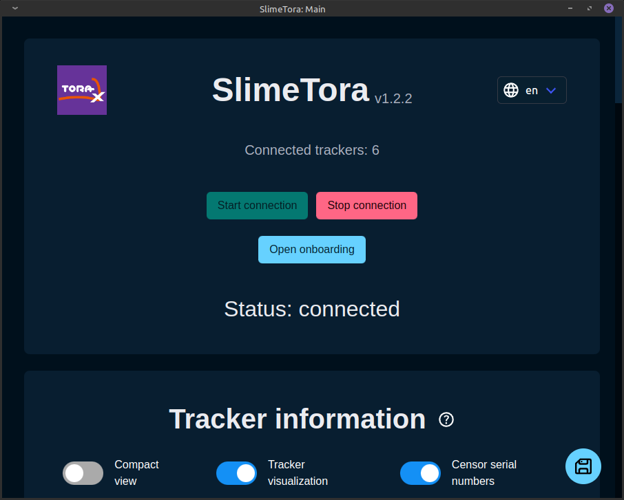

# SlimeTora

SlimeTora 是一个将 HaritoraX 追踪器连接到 SlimeVR 服务器的程序，使您可以将其用作 SlimeVR 追踪器，并附带额外功能，如每个追踪器的单独设置。它支持 `HaritoraX Wireless` 和 `HaritoraX Wired`（1.1b/1.1/1.0）型号。

## 先决条件

- 一台能够运行/串流 SteamVR 的 PC 和 VR 头显（Windows/Linux）
  - 可选地，您也可以在 SlimeVR 中使用 OSC 将数据转发到独立 HMD（例如 Quest、Pico 等）。
- 一套受支持的 HaritoraX 追踪器（请参见[此处](https://github.com/OCSYT/SlimeTora/wiki/FAQ#what-devices-are-supported)了解支持的型号）
- 最新版本的 [SlimeTora](https://github.com/OCSYT/SlimeTora/releases/latest)
- 最新版本的 [SlimeVR 服务器](https://github.com/SlimeVR/SlimeVR-Server/releases/latest)
  - **刚接触 SlimeVR 和 SlimeVR 服务器？** 请在此处阅读 SlimeVR 基础 wiki 页面：[https://github.com/OCSYT/SlimeTora/wiki/SlimeVR](https://github.com/OCSYT/SlimeTora/wiki/SlimeVR)
- 最新版本的 [HaritoraConfigurator](https://shop.shiftall.net/en-us/products/haritoraconfigurator-global)
  - 追踪器必须至少通过该软件配对/连接一次（并确保连接正常工作）。

## 设置

> 有关设置软件的更多详细信息，请参阅 SlimeTora 的 `Getting Started` wiki 页面：[https://github.com/OCSYT/SlimeTora/wiki/Getting-Started](https://github.com/OCSYT/SlimeTora/wiki/Getting-Started)

### SlimeTora 设置

- 在 SlimeTora 的 [releases](https://github.com/OCSYT/SlimeTora/releases/latest) 页面下载最新版本的应用程序。
- 将 zip 存档解压到自己的文件夹中，然后运行程序（`SlimeTora[.exe]`）。
  - 在 Linux 上，请确保将二进制文件标记为可执行：`chmod +x ./SlimeTora`
- 将出现"引导"屏幕。选择您希望如何设置 SlimeTora，自动或手动。
  - 推荐使用自动设置，它将引导您完成应用内的设置过程。您可以跳过以下说明，专注于应用的指示。
  - 如果您希望手动设置（或自动设置因某种原因不起作用），请继续阅读。
- 按"手动设置（跳过）"并向下滚动到"程序设置"：
  - 在"追踪器型号"下选择您拥有的 HaritoraX 追踪器型号（`HaritoraX Wireless`/`HaritoraX 1.1b/1.1/1.0`）。
  - 选择您想要用于连接追踪器的受支持连接模式（`Bluetooth`/`COM / GX(6/2)`）。
    - 如果使用 `HaritoraX Wireless`，这两种模式也可以同时使用。
  - （`COM`/`HaritoraX 1.1b/1.1/1.0`）选择您的蓝牙适配器分配给追踪器的 COM 端口。
    - `HaritoraX 1.1b/1.1/1.0`（有线）追踪器的端口可以在 HaritoraConfigurator 的"通信设置"中找到。
  - （`COM`/`GX(6/2)`/`HaritoraX Wireless`）选择最多 4 个追踪器所在的 COM 端口（如果仅使用 GX6 则为 3 个，如果使用 GX6+GX2 则为 4 个）。
    - 通常，这是前四个（连续的）可用端口。某些 COM 端口（例如 `COM1`）通常已被其他设备（如主板）使用，因此端口可能是 `COM2`、`COM3`、`COM4`（对于 GX2 为 `COM5`）。
    - 检查 `设备管理器` 以查看哪些端口正被追踪器用作 `USB 串行设备`。
- 根据您的喜好更改程序设置（请参阅[此文档](https://github.com/OCSYT/SlimeTora/wiki/Settings)了解说明）。
- 继续[SlimeVR 设置](#slimevr-设置)。

### SlimeVR 设置

- 安装并运行 [SlimeVR](../server/initial-setup.md) 服务器，打开您的追踪器，然后在 SlimeTora 中按 `Start connection`。
- 如果是首次运行 SlimeVR 服务器，请完成初始设置：
  - 接受在设置过程中任何时间点出现的所有提到"检测到新追踪器"的弹窗（这些就是您的追踪器！）
  - 按 `Skip Wi-Fi settings` 跳过`输入 Wi-Fi 凭据`屏幕。
  - 按 `I put stickers and straps!`。
  - 将追踪器分配到您的身体（摇晃以识别追踪器，或物理双击它们）。
  - 执行 `Automatic Mounting` 以校准安装位置。
    - 手动安装似乎相当难以调整，您可能需要反复尝试才能获得正确结果（这也是推荐自动的原因）。
  - 选择比例校准方法（自动/手动）。
- 如果这不是您第一次操作（或跳过了初始设置）：
  - 接受所有提到"检测到新追踪器"的弹窗（这些就是您的追踪器！）
  - 在`追踪器分配`中将追踪器分配到您的身体（摇晃以识别追踪器，或物理双击它们）。
  - 执行 `Automatic Mounting` 校准或 `mounting reset`（您应处于滑雪姿势）。
- 查看 SlimeVR 的其余设置，您就完成了！

## 故障排除与常见问题

> 完整的故障排除和常见问题页面，请查阅 SlimeTora wiki：[https://github.com/OCSYT/SlimeTora/wiki](https://github.com/OCSYT/SlimeTora/wiki)

### 我一直停留在"搜索中"！

如果使用 `HaritoraX Wired` 或带任何 `GX(6/2)` 适配器的 `HaritoraX Wireless`，请确保选择了正确的 COM 端口（参见[此文档](https://github.com/OCSYT/SlimeTora/wiki/Getting-Started)）。此外，HaritoraConfigurator 应已关闭；SlimeTora 和 HaritoraConfigurator 不应同时打开，因为多个应用程序无法同时与一个 COM 端口通信。

如果您使用带任何 `GX(6/2)` 适配器的 `HaritoraX Wireless`，且没有连接所有追踪器，从 `v1.2.0` 开始，您可能会遇到约 5 秒的延迟，程序才会实际找到您的追踪器（而不是瞬间找到）。这是由于 `haritorax-interpreter` 的后端更改所致，它最终应该会连接到您的追踪器，但可能会有一些错误。强烈建议您在开始连接之前打开所有追踪器——此逻辑将在未来某个时候重做以防止此问题。

### 我的一些追踪器无法连接到 SlimeTora！

最常见的解决方法是打开 `HaritoraConfigurator` 软件，确保在再次通过 SlimeTora 连接之前追踪器已配对/可以连接。不确定为什么会发生这种情况，但这是最有可能的解决方法（除了常规检查清单外）——这尤其适用于使用任何 `GX(6/2)` 适配器的 `HaritoraX Wireless` 用户。

如果您使用蓝牙（Classic/LE），当您在 SlimeTora 上停止连接时，追踪器会有相当大的延迟。如果您快速重新连接，这一点尤其明显，因为追踪器尚未完全断开。请确保在尝试重新连接之前至少等待 10 秒，或等到追踪器 LED 指示已断开（缓慢闪烁）。

### 我的腿部（或其他部位）向后移动！

请仔细检查您的追踪器分配，并确保已在 SlimeVR 服务器中执行了 `Automatic mounting calibration`——如果第一次不行，您可能需要尝试多次。手动安装校准似乎在追踪器上有些难以调整，可能需要反复尝试才能正确。

### 我的全身追踪效果不佳！

最可能的原因是校准不正确——尝试重新执行 SlimeVR 中的校准步骤以获得更好的结果。ZRock35 的以下视频是一个很好的指南，教您如何获得最佳的 SlimeVR 校准效果：[https://www.youtube.com/watch?v=SYqfQdVseF4](https://www.youtube.com/watch?v=SYqfQdVseF4)

默认情况下，SlimeVR 使用 `prediction` 过滤设置来估计追踪器的位置，因此切换为 `smoothing` 或 `no filtering` 也可能有助于解决追踪器位置偏差问题（未确认）。

如果您在追踪下半身时遇到问题，通常仍然是校准问题，因此如上所述，尝试重新校准。您还可以尝试在 SlimeVR 设置的 `SteamVR Trackers` 下禁用膝盖追踪，以查看是否有帮助（禁用 `Automatic tracker assignment` 然后禁用两个膝盖）。膝盖追踪器仍将用于 SlimeVR 中的骨骼追踪，但不会作为额外追踪器出现在 SteamVR 中，这*可能*有助于解决下半身的一些追踪问题。

### 我的追踪器没有正确对齐到身体！

请确保您已正确完成了`身体比例校准`（手动或自动），并确保您已执行了 `Automatic mounting calibration`（因为手动安装对这些追踪器来说相当难以调整）。您还可以更改您正在运行的游戏中的设置（例如 VRChat 的 IK 设置，如 `Legacy calibration`），或者物理更改追踪器的位置。

如果运行 VRChat，[此处](./vrchat-config.md)有一些推荐的设置。

### "自动比例"被禁用/追踪器无法在 SteamVR 中显示！

假设您此时已戴上 VR 头显，请确保 SlimeVR 加载项已正确安装/启用。您可以在 SteamVR 设置 > 管理加载项中查找 `slimevr`，如果被禁用则启用。如果未正确安装且未显示，请尝试重新安装 SlimeVR 服务器。

您也可以通过下载该驱动程序的[最新版本](https://github.com/SlimeVR/SlimeVR-OpenVR-Driver/releases/latest)，然后将存档中的 `slimevr` 文件夹复制到 Windows 的 `C:\Program Files (x86)\Steam\steamapps\common\SteamVR\drivers\` 或 Linux 的 `~/.steam/root/steamapps/common/SteamVR/drivers/`（如果 `slimevr` 目录不存在则创建）来手动安装 SlimeVR 加载项。

*由 JovannMC 编写，软件由 BracketProto 和 JovannMC 开发。*
