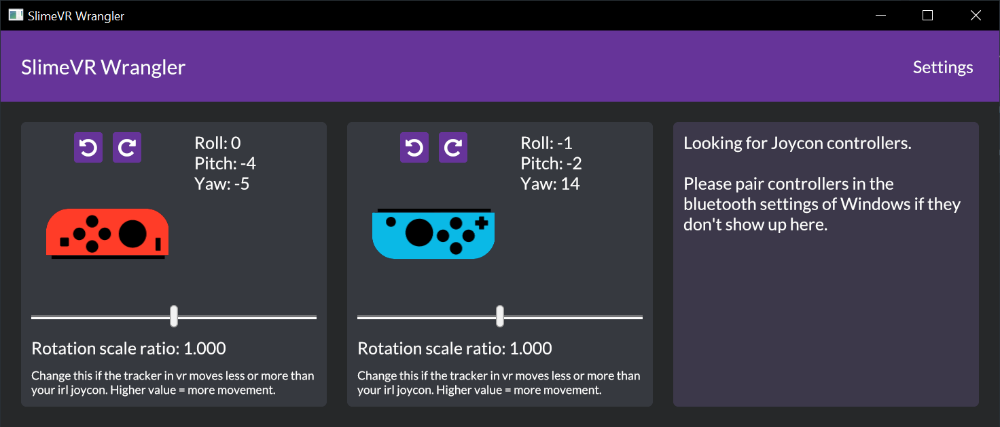

# SlimeVR Wrangler

本指南将帮助您安装和使用 SlimeVR Wrangler，该工具允许将 Nintendo Switch Joy-Con 用作 SlimeVR 追踪器。

## 设置

您的计算机需要具备蓝牙功能。
* 下载并设置 [SlimeVR](../server/initial-setup.md)
* 下载 [SlimeVR Wrangler](https://github.com/carl-anders/slimevr-wrangler/releases/latest/download/slimevr-wrangler.exe)
* 同时启动 SlimeVR 服务器和 SlimeVR Wrangler
* 将您的 Joy-Con 追踪器连接到计算机（[Windows 指南](https://www.digitaltrends.com/gaming/how-to-connect-a-nintendo-switch-controller-to-a-pc/)）
* 确保 SlimeVR Server 正在运行，然后在 SlimeVR Wrangler 中按下"Search for Joycons"
* Joy-Con 应该会在窗口中显示！
* [在 SlimeVR Server 中设置新的追踪器](../server/connecting-trackers.md)

### 安装

确保摇杆朝外，不应刺入您的皮肤。

在程序中连接 Joy-Con 后，在程序中旋转它们，使其旋转方向与您站立时的方向一致。

以最适合您的方向安装 Joy-Con，请参考[佩戴追踪器](../server/putting-on-trackers.md)页面了解安装位置和追踪器分配。

## 问题

很多！这是一个 **alpha** 版本，不提供任何保证。

* 旋转追踪效果差！——是的，抱歉。未来会有设置来帮助微调追踪。建议[设置重置快捷键](../server/setting-reset-bindings.md)。
* 转身时停止追踪！——蓝牙的覆盖范围不佳，使用不同的蓝牙适配器可能会有所改善。
* 可能还有更多问题。

### 我的 Joy-Con 已在 Windows 蓝牙菜单中连接但无法显示！

这可能与较新的 Windows 更新有关。尝试以下方法，可能可以解决：
* 前往 Windows 设置应用 -> 蓝牙和其他设备。
* 按下无法连接的 Joy-Con。点击"移除设备"。
* 重新配对设备。现在它应该会显示出来。

*由 Carl 创建（<https://github.com/carl-anders>），由 nwbx01 编辑。*
