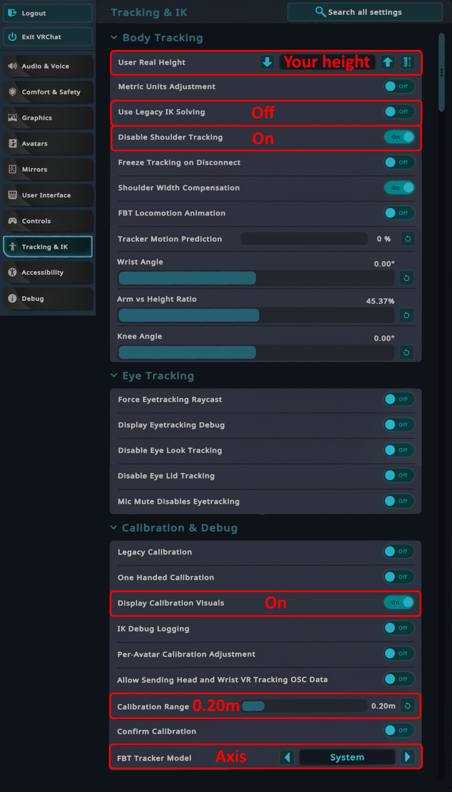

# VRChat 配置

为了在 VRChat 中获得最佳使用体验，建议按照本指南所述配置设置。

## 文字指南

- 在大设置菜单的"Tracking & IK"下
  - 将"User Real Height"设置为您的身高。
  - 关闭"Use Legacy IK Solving"。
  - 开启"Disable Shoulder Tracking"。
  - （推荐）开启"Display Calibration Visuals"。
  - （适用于小型人物模型）将"Calibration Range"设置为 0.20m。
  - （可选）将"FBT Tracker Model"设置为"Axis"。
- 在小设置菜单（腕部菜单）的"Tracking & IK"下
  - （推荐）将"Avatar Measurement"缩放模式设置为"Height:"。
  - （推荐）将"FBT Spine Mode"设置为"Lock Hip"或"Lock Head"。

## 视觉指南

